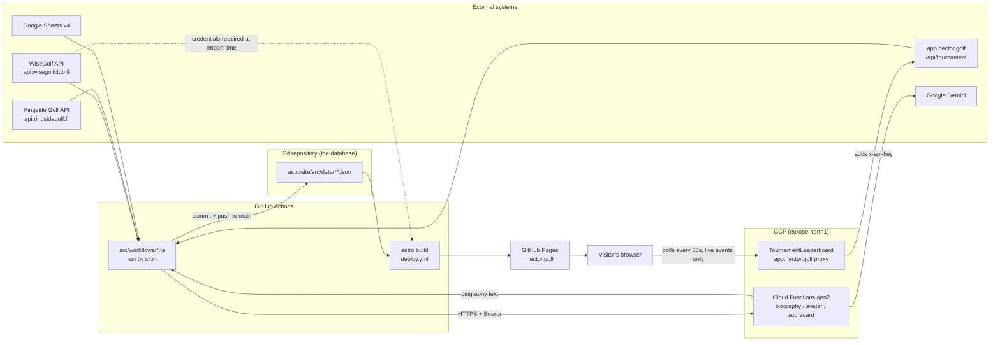
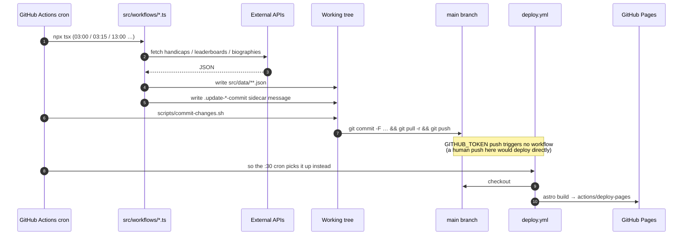

# hector.golf — Technical Architecture

_Last reviewed: 2026-09-10_

## 1. Overview

hector.golf is the public site for the **Hector Trophée**, an invitational amateur golf series
(Hector = team competition, Victor = individual, plus Matchplay and Finnkampen formats). It
publishes event pages, live-ish leaderboards, player profiles with handicap histories, and course
guides at <https://hector.golf>.

The defining architectural property is that **the Git repository is the database**. There is no
runtime server and no request-time API call anywhere in the delivered site. Instead, scheduled
GitHub Actions run TypeScript scripts that scrape external golf systems, write the results as JSON
into `astrosite/src/data/`, and commit that JSON back to `main`. A deploy workflow rebuilds the Astro
site from the committed data and publishes it to GitHub Pages — on every push to `main` that touches
`astrosite/**`, and additionally on a twice-daily cron (see §8 for why both are needed). Everything a
visitor sees was computed at build time.

Three moving parts:

| Part | Location | Role |
| --- | --- | --- |
| Astro site | `astrosite/` | Static site generator, domain logic, committed JSON data, and the workflow scripts |
| Cloud Functions | `backend/backend-functions/` | Four HTTP-triggered GCP functions: three Google Gemini wrappers plus the leaderboard proxy |
| CI/CD | `.github/workflows/` | Nine workflows: one deploy, one PR check, four scheduled data updates, two Terraform, one admin deploy |
| Infrastructure | `terraform/` | The `hector-golf` GCP project: Firestore, Cloud Run, IAP, Artifact Registry, CI identities |



Everything except the last two edges runs on a schedule: a data change is a commit, and a commit is a
full rebuild. Those two edges are the exception — the live leaderboard reaches a visitor without
waiting for a deploy.

## 2. Repository layout

```
.
├── astrosite/                  # Astro 7 site: pages, domain code, JSON data, workflow scripts
│   ├── src/
│   │   ├── pages/              # File-based routing, 15 pages, all prerendered
│   │   ├── components/         # .astro components
│   │   ├── layouts/            # Layout.astro (the only layout)
│   │   ├── styles/             # hector.css — the design system (see §3)
│   │   ├── code/               # Domain layer (not "lib" or "utils")
│   │   ├── schemas/            # Zod schemas; source of truth for all types
│   │   ├── data/               # The database: committed JSON
│   │   ├── workflows/          # Node scripts run by CI, not by the build
│   │   └── content.config.ts   # Astro content collections (mostly unused, see §5)
│   ├── docs/mscorecard-api.md  # Reverse-engineered mScorecard protocol notes
│   ├── scripts/commit-changes.sh
│   └── test/{unit,astro}/
├── backend/backend-functions/  # GCP Cloud Functions gen2 (Gemini wrappers + leaderboard proxy)
├── terraform/                  # The hector-golf GCP project (see docs/gcp-setup-playbook.md)
├── .github/workflows/          # Nine workflows
└── docs/                       # This document and the setup playbook
```

There is **no monorepo tooling**. `astrosite/` and `backend/backend-functions/` are two independent
npm packages with no shared dependencies, no workspace root, and no cross-package imports. They
communicate only over HTTPS at data-update time.

## 3. The web application (`astrosite/`)

### Stack

Astro 7 with default **static output** — no adapter, no SSR, no `output` setting in
[`astro.config.mjs`](../astrosite/astro.config.mjs), which is seven lines long and sets only
`site: 'https://hector.golf'` and the React integration. TypeScript 6 (`astro/tsconfigs/strict`),
Zod for all schemas, Vitest 4 for tests, Chart.js for the one interactive widget.

`@astrojs/react` and React 19 are installed and registered as an integration, but **no `.tsx` or
`.jsx` file exists in the repo** and there are zero `client:*` directives anywhere. The integration
is vestigial.

`npm run build` is `astro check && astro build` — type-checking gates the build.

### Routes

Every dynamic route implements `getStaticPaths()`. There are no API endpoints and no `pages/api/`.

| File | Route | Purpose |
| --- | --- | --- |
| `index.astro` | `/` | Landing page: hero, up to three featured live/upcoming events, four cards |
| `404.astro` | `/404` | Custom not-found |
| `events/index.astro` | `/events` | All formats, grouped ongoing / upcoming / past |
| `events/hector/index.astro` | `/events/hector` | Hector events only |
| `events/hector/[slug].astro` | `/events/hector/:id` | The richest page: field, buckets, rounds, winners |
| `events/hector/[slug]/leaderboard.astro` | `/events/hector/:id/leaderboard` | Generated for events with a leaderboard JSON, or configured to poll app.hector.golf |
| `events/matchplay/index.astro` | `/events/matchplay` | Matchplay events |
| `events/matchplay/[slug].astro` | `/events/matchplay/:id` | Single-elimination bracket |
| `players/index.astro` | `/players` | Grid, ranked by a seven-level win comparator |
| `players/[slug].astro` | `/players/:id` | Biography, handicap chart, appearances |
| `courses/index.astro` | `/courses` | Sorted by most recent event played there |
| `courses/[slug].astro` | `/courses/:id` | Description, tee ratings, scorecard, hole grid |
| `courses/[slug]/holes/[hole].astro` | `/courses/:id/holes/:n` | Per-hole page with wraparound nav |
| `golfreport/index.astro` | `/golfreport` | Archive of magazine cover images |
| `brand.astro` | `/brand` | The colour brandbook, generated from the stylesheet (see below) |

### Layers

- **`src/schemas/`** — Zod schemas (`events.ts`, `players.ts`, `courses.ts`, `handicaps.ts`). Types
  are derived with `z.infer`; these schemas are the single source of truth for both validation and
  typing.
- **`src/code/`** — the domain layer. `data.ts` (loading), `events.ts`, `players.ts`, `courses.ts`,
  `stats.ts`, `dates.ts`, `rounds.ts`, `scoring.ts`, `strings.ts`, `palette.ts`, plus the
  `handicaps/` and `leaderboards/` integration subpackages and the standalone `mscorecard/` SDK.
- **`src/components/`** — `.astro` components grouped by domain (`courses/`, `events/`, `players/`,
  `golfreport/`) plus the shared shell pieces at the top level: `PageHeader`, `Card`, `Breadcrumb`,
  `Highlight`, and the trophy marks `HectorMark` / `VictorMark` / `MatchplayMark` behind
  `CompetitionMark`.
- **`src/styles/hector.css`** — the design system, imported once by the layout. See below.
- **`src/layouts/Layout.astro`** — the only layout. Carries the Google Tag Manager bootstrap
  (`GTM-56L7SB92`), `<meta name="robots" content="noindex,follow">`, a `published-at` build
  timestamp, the favicon/manifest links and the Google Fonts stylesheet, and the sticky site header
  and footer. `public/robots.txt` also disallows everything — the site is deliberately not indexed.

**`src/code/mscorecard/`** is a self-contained SDK and CLI for mscorecard.com, reverse engineered
from the iOS app's traffic and documented in
[`astrosite/docs/mscorecard-api.md`](../astrosite/docs/mscorecard-api.md). It is not part of the
site: nothing under `src/pages/`, `src/components/` or `src/workflows/` imports it, no npm script
runs it, and it reaches the network only when a developer invokes
`npx tsx src/code/mscorecard/cli/main.ts` with `MSCORECARD_EMAIL` / `MSCORECARD_PASSWORD` set. It
shares the repository, and `src/code/scoring.ts`, with the site — nothing else.

### The design system

The site shares a visual language with the scorecard app at <https://app.hector.golf>, and
[`src/styles/hector.css`](../astrosite/src/styles/hector.css) is where that language lives: ~780
lines holding the token set, a small reset, base typography, and the component primitives that pages
compose from — `.card`, `.pill`, `.btn`, `.chip-num`, `.num`, `.score`, `.label`, `.eyebrow`,
`.table-scroll`, `.page`, `.section`, `.grid`, `.segmented`, `.breadcrumbs`. Palette, type scale and
primitives mirror the app's Tailwind theme one-to-one.

It is imported exactly once, by `Layout.astro`; pages and components add only their own scoped
`<style>` blocks on top. There is no longer a single global breakpoint — components declare their
own — and the stylesheet honours `prefers-reduced-motion`.

**Colour carries meaning, and the meanings do not overlap.** Ink (`--ink-50` … `--ink-950`) is the
neutral scale everything sits on, biased slightly toward violet rather than being a flat grey.
Violet is reserved for the *interface*: links, buttons, focus, selection, active navigation. Each
competition therefore gets a hue of its own, so a competition colour can never be mistaken for
interface state:

| Token | Hue | Stands for |
| --- | --- | --- |
| `--hector` / `--hector-soft` | gold, ~42° | The Hector pairs competition; also the wordmark and page eyebrows |
| `--victor` / `--victor-soft` | fairway green, ~99° | The Victor individual competition |
| `--matchplay` / `--matchplay-soft` | ember, ~17° | Matchplay |

The greens are deliberately kept apart: Victor's fairway green sits well clear of the `--emerald-400`
that means "live". The `-soft` tone of each pair is one step lighter, for type and figures small
enough that the base tint would strain.

**Trophy marks are components, not images.** `HectorMark`, `VictorMark` and `MatchplayMark` are
inline SVG drawn in `currentColor`, and [`CompetitionMark`](../astrosite/src/components/CompetitionMark.astro)
is the single place that pairs a competition with both its shape and its tint — so a Victor trophy
cannot come out gold on one page and ember on another. `WinBadge` replaced the three near-identical
`players/icons/*WinIcon.astro` components, which had drifted into rendering every trophy in the same
gold.

[`PageHeader`](../astrosite/src/components/PageHeader.astro) is the standard masthead — gold eyebrow,
serif display title, mono metadata strip, optional lede. Every page uses it, directly or through
`EventList`, except the landing page (which has a bespoke hero), the 404 and the per-hole page. Its
metadata parts are laid out as flex items rather than one joined string, so a date range wraps as a
whole unit instead of being chopped mid-range.

### The brandbook is generated, not written

[`/brand`](../astrosite/src/pages/brand.astro) documents the palette, and it is built *from* the
stylesheet rather than describing it. [`src/code/palette.ts`](../astrosite/src/code/palette.ts)
parses the `:root` block out of `hector.css?raw` at build time, follows `var()` chains to real
values, and computes hex, RGB, hue angle and WCAG contrast against the page ground. Every figure on
the page is measured, every swatch paints with `var(--token)`, and the specimens are the real
components — so the brandbook cannot drift from the site.

[`test/unit/palette.test.ts`](../astrosite/test/unit/palette.test.ts) then asserts the palette's
rules against the shipped stylesheet: every competition colour stays legible on the page ground, the
three stay far apart in hue, the par colours read as one set, Victor stays clear of the "live"
emerald, and violet never stands for a competition. Changing a colour in `hector.css` can fail the
test suite.

### Client-side JavaScript

The delivered site is essentially static HTML. There is no state management, no router, and no
search. Four pieces of client JS exist in total:

1. **Handicap chart** — [`HandicapHistoryChart.astro`](../astrosite/src/components/players/HandicapHistoryChart.astro)
   renders a `<canvas>` carrying the last 20 handicap entries in `data-` attributes, and loads
   [`HandicapHistoryChart.ts`](../astrosite/src/components/players/HandicapHistoryChart.ts) (bundled
   by Astro) which draws a Chart.js time series with a custom `afterRender` plugin painting the
   current handicap in a gold filled circle. Being a bundled TS module rather than a stylesheet, it
   is the one place that restates the palette's hex values by hand (see §13).
2. **Bracket connectors** — [`SingleEliminationBracketV2.astro`](../astrosite/src/components/events/SingleEliminationBracketV2.astro)
   pulls `leader-line` from cdnjs (SRI-pinned, `is:inline`) and draws connector lines between match
   elements on `DOMContentLoaded`.
3. **Leaderboard auto-refresh** — for a Sheets-managed event, the leaderboard page runs a
   `setInterval` that hard-reloads with a cache-busting query string every five minutes. An
   app.hector.golf-managed event gets [`LiveLeaderboard.astro`](../astrosite/src/components/events/LiveLeaderboard.astro)
   instead, which polls the leaderboard proxy (§10) and rewrites the rendered rows in place, cloning
   the component's own row template so the replacements keep their scoped styles.
4. **Google Tag Manager** — the inline bootstrap in `Layout.astro`.

## 4. Data model

All content lives as JSON committed under [`astrosite/src/data/`](../astrosite/src/data/):

| Path | Count | Written by | Contents |
| --- | --- | --- | --- |
| `players/*.json` | 45 | Human + CI | Identity, contact, club, current handicap, `misc` hints, AI-generated `biography[]` |
| `events/hector/*.json` | 13 | Human + CI | `HECTOR2014`–`HECTOR2026` |
| `events/matchplay/*.json` | 3 | Human | `HECTORMATCHPLAY2024`–`2026` |
| `events/finnkampen/*.json` | 2 | Human | `FINNKAMPEN2021`–`2022` |
| `courses/*.json` | 17 | Human | Tees, ratings, slope, scorecard, per-hole descriptions |
| `leaderboards/*.json` | 6 | CI only | Per-event Hector and Victor standings |
| `handicaps.json` | 1390 entries | CI only | Append-only `{player, date, handicap}` time series |
| `clubs.json` | 140 clubs | CI only | Finnish golf clubs `{name, abbreviation, sources[]}` |

### Events are a discriminated union

`Event` is a Zod discriminated union on `format`
([`src/schemas/events.ts`](../astrosite/src/schemas/events.ts)), with `hectorEventSchema`,
`matchplayEventSchema`, and `finnkampenEventSchema` extending a shared `BaseEventSchema`. Hand-written
type guards `isHectorEvent` / `isMatchplayEvent` / `isFinnkampenEvent` live in
[`src/code/data.ts`](../astrosite/src/code/data.ts).

**The directory name must equal the `format` discriminator**, because `pathToEventJson()` builds the
write path as `../data/events/${event.format}/${event.id}.json`.

### Event dates are structured, not prose

`BaseEventSchema` carries `timing: { start, end }`, two ISO calendar dates (`"2026-09-24"`) validated
by `isValidIsoDate` and refined so an event cannot end before it starts. A one-day event repeats the
same date on both sides, so there is no "no end date" case for a reader to forget about.

This replaced a single `date` string holding prose — `"September 24-27, 2026"` — which was easy to
write and hard to use: the date a given round is played is arithmetic on the start date, and
arithmetic wants a date rather than a sentence to parse. The refinement lives on the `timing` object
rather than on the event because `z.discriminatedUnion` rejects an option carrying one.

### Scoring rules are data, not code

The Hector event schema encodes the competition rules declaratively: `rounds[].gameFormats[]` carries
a `format` enum (Stableford NET/SCR, Stroke Play, Better Ball, Scramble…), `handicapAllowance`,
`contribution: {hector, victor}` fractions, `teamContribution: 'both' | 'better' | 'team'`, and
`birdieBonus` / `eagleBonus`.

`RoundsList.astro` renders these into English prose ("Hector points: 33% of the better individual's
score"). **Nothing in this repository computes scores from them** — actual scoring happens in the
external scoring systems (Google Sheets or app.hector.golf), and only the resulting standings are
imported.

### Player identity

A player's `id` is not derived from the filename: `players/lasse-koskela.json` has `"id": "lasse-k"`.
All lookups go through `id`; the filename is incidental. Players may carry `aliases[]` (alternative
spellings used by external scoring systems) and `privacy: 'shorten-last-name'`.

## 5. Data access — two parallel mechanisms

This is the most surprising part of the codebase and the easiest place to make a wrong assumption.

### (a) Astro content collections — declared, mostly unused

[`src/content.config.ts`](../astrosite/src/content.config.ts) defines three collections — `courses`,
`players`, `events` — with the `glob()` loader and the Zod schemas.

Only **`courses`** is ever read, by four pages. The two `courses/[slug]` pages call `getCollection`
solely to produce `getStaticPaths()`, then re-fetch the actual data through `getCourseById()`;
`courses/index.astro` reads it for real, and `brand.astro` pulls a course from it for one specimen.
The `players` and `events` collections are declared and never read by anything.

### (b) `src/code/data.ts` — the path actually used

At module load, using top-level `await`, it globs the JSON, `safeParse`s each file, and drops
anything that fails validation:

```ts
export const eventsData: Event[] = (await glob("src/data/events/**/*.json"))
    .map((filePath) => EventSchema.safeParse(JSON.parse(readFileSync(filePath, "utf-8"))).data)
    .filter(nonUndefined);
```

`eventsData`, `hectorEvents`, `playersData`, and `coursesData` are **module-level singletons shared
across the entire build**. Two consequences worth internalising:

- **Glob paths are relative to the working directory**, not to the module. Every command — build,
  tests, workflow scripts — must be run from `astrosite/`.
- **The singletons are mutated in place.** `populateMissingParticipants()` and
  `populateUpdatedHandicaps()` in [`src/code/events.ts`](../astrosite/src/code/events.ts) modify the
  shared event objects, so their effects persist across every page rendered later in the same build.

A **third** mechanism exists in
[`src/code/leaderboards/leaderboards.ts`](../astrosite/src/code/leaderboards/leaderboards.ts): it
uses `import.meta.glob` for discovery, rewrites the resulting keys into CWD-relative paths, then
reads the files with `readFileSync`.

Validation failures are silent. A malformed data file does not fail the build — it simply vanishes
from the site.

## 6. Build-time derivation

A significant amount of logic runs during `astro build` rather than being precomputed into the data
files:

- **Current handicap** — `getPlayerHandicapById()` sorts `handicaps.json` by date and takes the last
  entry. `getPlayerById()` then applies `player.handicap || handicapFromHistory`, so the JSON field
  acts as a manual override of the scraped history.
- **Projected buckets** — for *future* Hector events only, `populateUpdatedHandicaps()` refreshes the
  stored bucket handicaps from the live history, so "Projected Buckets" stay current between
  scheduled data runs.
- **Participant back-fill** — if `participants` is empty, `populateMissingParticipants()`
  reconstructs it from `results.teams[].players` or from the matchplay bracket's `left`/`right`.
- **Winner inference** — `events/hector/[slug].astro` promotes the top leaderboard row to
  Hector/Victor champion when the event JSON records no winners *and* every leaderboard entry reads
  `through === "F"`.
- **Leaderboard enrichment** — `enrichLeaderboard()` splits the stored display strings
  (`"Lasse Koskela + Jari Kuusela"`) with `splitCompetitorNames()`, which accepts `+` or `&` because
  Sheets and app.hector.golf disagree on the separator, and resolves each name back to a `Player`
  through an index built from full names, privacy-shortened names, and all aliases. It normalises
  `through` to `"F"` when complete and synthesises anonymous `"Team N"` placeholders before play
  starts.
- **Positions** — `leaderboardPosition()` computes `1` / `T3` ranks honouring the per-competition
  scoring direction (`hector: ascending` because it counts strokes; `victor: descending` because it
  counts Stableford points). It lives in `leaderboards/presentation.ts` alongside the score, diff and
  `through` formatters, so the statically rendered board and the live one cannot drift apart — that
  module is free of `fs` and Zod precisely so the browser can import it.
- **Chronological grouping** — `getAllEventsGroupedByChronology()`, with the special rule that a
  matchplay event holding a recorded winner counts as past regardless of its dates.
- **Date formatting** — events store ISO dates, so the derivation now runs the other way:
  `formatEventDates()` / `formatDateRange()` in [`dates.ts`](../astrosite/src/code/dates.ts) render
  `timing` into display prose, and the chronology predicates (`eventHasStarted`, `isPastEvent`,
  `yearOfEvent`) are plain string or `Date` comparisons on `timing.start` / `timing.end` rather than
  regex-matching a sentence.
- **Round scheduling** — a round records a `day` offset into the event, not a date.
  [`rounds.ts`](../astrosite/src/code/rounds.ts) turns that into a real date (`dateOfRound()`, day 1
  being the event's first day) and into a title (`titleOfRound()` → "Saturday morning"). The part of
  day is inferred from the round's position within its day, and a day holding a single round is
  named by its weekday alone rather than being guessed into a "morning".
- **Privacy name shortening** — for players marked `privacy: 'shorten-last-name'`, a singleton in
  [`players.ts`](../astrosite/src/code/players.ts) computes the *shortest unique last-name prefix*
  among players sharing a first name, so "Lasse Koskela" renders as "Lasse K" while two Johns would
  become "John De" / "John Di".
- **Player ranking** — `players/index.astro` sorts with a seven-level comparator: total wins →
  Hector wins → Victor wins → Matchplay wins → most recent win → most recent start → start count →
  name.

## 7. External integrations

| System | Module | Auth | Purpose |
| --- | --- | --- | --- |
| WiseGolf | `code/handicaps/wisegolf-api.ts` | Username/password → bearer token | Official WHS handicaps, club directory, club membership |
| Ringside Golf | same module | Same token | Second player-lookup endpoint |
| Google Sheets v4 | `code/leaderboards/google-sheets.ts` | Service account (`GOOGLE_CREDENTIALS`) | Live leaderboards for sheet-managed events |
| app.hector.golf | `code/leaderboards/app.ts` | `x-api-key` | Live leaderboards for app-managed events |
| app.hector.golf (browser) | `code/leaderboards/app-payload.ts` | None — via the `TournamentLeaderboard` proxy (§10) | The same standings, polled from the visitor's browser |
| GitHub Contents API | `code/leaderboards/github.ts` | `GITHUB_ACCESS_TOKEN` (Octokit) | Commits leaderboard JSON directly |
| Google Gemini | via `backend/` functions | Bearer (`ASTROSITE_API_KEY`) | Biography and avatar generation |

Notable details:

- **`HandicapSource` interface** —
  [`handicap-source-api.ts`](../astrosite/src/code/handicaps/handicap-source-api.ts) defines
  `getPlayerHandicap`, `resolveClubMembership`, and `getClubs`, plus a `NullHandicapSource`
  fallback. `update-handicaps.ts` pops sources off a list and falls through on failure, so adding a
  second provider is a matter of implementing the interface.
- **WiseGolf client** uses `fetch-h2` with browser-mimicking headers, `micro-memoize` (15-minute TTL
  on the login, longer on club lists), and `p-ratelimit` throttling (5 req/s, concurrency 1).
- **It calls `process.exit(1)` at import time** when `WISEGOLF_USERNAME` / `WISEGOLF_PASSWORD` are
  missing. This is why the deploy workflow and the test suite both need WiseGolf credentials even
  though neither performs a handicap fetch.
- **Google Sheets access is layout-tolerant**: rather than fixed ranges, `google-sheets.ts` searches
  the `LEADERBOARD` tab for anchor cells (`findCellContaining`, `findCellBelowContaining`,
  `findEmptyCellBelow`) and derives the data range from them.
- **app.hector.golf responses are read strictly on the write path and loosely in the browser.**
  `app.ts` Zod-validates the payload in full before anything can be written to a data file and
  published; `app-payload.ts` checks only the fields it renders, because a payload the browser does
  not recognise costs a viewer one live update rather than corrupting stored results. Both share the
  same extractors, so the field mapping is defined once, and both project down into the
  `GoogleSheetTeamLeaderboard` / `GoogleSheetIndividualLeaderboard` shapes the Sheets path produces,
  so everything downstream is source-agnostic.

## 8. The data pipeline

This is how the system is actually operated.



### Two mechanics that explain the design

**The deploy has two triggers, and the cron is not the main one.** `deploy.yml` runs on every push to
`main` whose changes touch `astrosite/**` or `.github/workflows/**`, so ordinary human commits — a
new event JSON, a component change — rebuild and publish the site immediately.

The `30 3,12` cron exists to cover the one case that push cannot: commits made by the data pipeline
itself. Pushes authenticated with `GITHUB_TOKEN` deliberately do not trigger further workflows, so
the automated data commits cannot set off `deploy.yml`. The cron runs half an hour after the `:00`
and `:15` data jobs to pick up what they committed.

**Why `update-leaderboards` is different.** Alone among the four, it writes its output through the
**GitHub Contents API** (Octokit `createOrUpdateFileContents` against
`astrosite/src/data/leaderboards/<eventId>.json`) rather than into the local working tree. Those
commits bypass `commit-changes.sh` entirely. Only its secondary effect — back-filling `results.teams`
into the event JSON — goes through the normal working-tree path.

### The commit-back script

[`scripts/commit-changes.sh`](../astrosite/scripts/commit-changes.sh) is shared by all four update
workflows:

1. Exits 0 immediately unless `git status --short` shows modified files under `src/data/`.
2. Builds a commit message from `$GITHUB_WORKFLOW`, `$GITHUB_EVENT_NAME`, `$GITHUB_RUN_NUMBER`.
3. Appends the contents of the sidecar files each workflow script leaves behind
   (`.update-handicaps-commit`, `.update-player-biographies-commit`), then deletes them.
4. Stages exactly the changed data files, lists them in the message, then
   `git commit -F … && git pull -r && git push`.

This is the source of the `Github Action: Update players' official handicaps` commits that dominate
the history.

### The workflow scripts

| Script | Schedule (UTC) | Reads | Writes |
| --- | --- | --- | --- |
| `update-handicaps.ts` | `0 3,13 * * *` | WiseGolf | `handicaps.json`, `players/*.json`, event `buckets` |
| `update-leaderboards.ts` | `15 3,12 * * *` | Sheets / app.hector.golf | `leaderboards/*.json` (via API), event `results.teams` |
| `update-player-biographies.ts` | `30 2 10,25 * *` | GCP function, WiseGolf | `players/*.json` `biography`, `clubs.json` |
| `update-player-club-memberships.ts` | `15 22 15 * *` | WiseGolf | `players/*.json` `club` |

**`update-handicaps.ts`** — the largest at 310 lines. For each player holding a `club`, it fetches
the current handicap through the source chain and appends changed values to `handicaps.json`
(replacing a same-day duplicate if the association re-ran a batch). It then re-sorts each upcoming
event's participants with `sortPlayersForBucketing` — by current handicap, tie-broken so that a
player whose handicap is *falling* ranks ahead of one whose is rising — and splits them into two
equal buckets written back into the event JSON. `getPlayerHandicapFromHistory` and
`sortPlayersForBucketing` are exported specifically so the unit tests can import them.

**`update-leaderboards.ts`** — selects Hector events that hold a `leaderboardSheet` URL and have
already started (`updateFutureEvents = false`), then dispatches on the URL shape: `app.hector.golf/*`
against the app API, `docs.google.com/spreadsheets/*` against Sheets. It also back-fills
`results.teams` into the event JSON from leaderboard pairings when the event has none recorded yet.

**`update-player-biographies.ts`** — assembles a `PlayerBiographyInput` per player (name, gender,
home club resolved through `clubs.json`, past appearances, Hector/Victor wins, `misc` details, the
next event and whether they are playing it, a `retired` flag when more than seven events have passed
since their last appearance, and **the biographies already generated in this run** so the model
avoids repeating phrasing) and POSTs it to the `GeneratePlayerBiography` Cloud Function. As a side
effect it regenerates `clubs.json` by merging the club lists from all handicap sources.

**`update-player-club-memberships.ts`** — for players with no `club`, searches every source by name
and assigns a club **only when exactly one** club matches.

## 9. CI/CD

| Workflow | Trigger | Runs | Permissions |
| --- | --- | --- | --- |
| `deploy.yml` | Push to `main` touching `astrosite/**` or workflows; cron `30 3,12 * * *`; manual | `withastro/action@v6` → `actions/deploy-pages@v5` | `contents: read`, `pages: write`, `id-token: write` |
| `pr-checks.yml` | PRs targeting `main` | `npm ci` → `npm test` → `npm run build` | `contents: read` |
| `update-handicaps.yml` | Cron `0 3,13 * * *`; manual | Script + `commit-changes.sh` | `contents: write` |
| `terraform-plan.yml` | PRs touching `terraform/**` | `fmt` → `init` → `validate` → `plan`, posted as a PR comment | `contents: read`, `id-token: write`, `pull-requests: write` |
| `terraform-apply.yml` | Push to `main` touching `terraform/**`; manual | `terraform apply`, gated by the `infrastructure` environment | `contents: read`, `id-token: write` |
| `deploy-admin.yml` | Push to `main` touching `admin/**`; manual | Build, push to Artifact Registry, `gcloud run deploy` | `contents: read`, `id-token: write` |
| `update-leaderboards.yml` | Cron `15 3,12 * * *`; manual | Script + `commit-changes.sh` | `contents: write` |
| `update-player-biographies.yml` | Cron `30 2 10,25 * *`; manual | Script + `commit-changes.sh` | `contents: write` |
| `update-player-club-memberships.yml` | Cron `15 22 15 * *`; manual | Script + `commit-changes.sh` | `contents: write` |

**Deployment target is GitHub Pages**, with the custom domain supplied by
[`public/CNAME`](../astrosite/public/CNAME) (`hector.golf`; `www` 301s to it). The build step passes
`--site ${{ steps.pages.outputs.origin }} --base ${{ steps.pages.outputs.base_path }}` so the Pages
environment determines the final URLs, and uses concurrency group `pages` with
`cancel-in-progress: false`.

The four update workflows share an identical boilerplate skeleton, including a vestigial "Detect
package manager" step that always resolves to npm.

Dependabot is active (see the merged `Bump the npm_and_yarn group…` commits) but runs from the
repository's security settings — there is no `.github/dependabot.yml`.

### Secrets and variables

| Name | Kind | Used by |
| --- | --- | --- |
| `WISEGOLF_USERNAME` | Variable (also hardcoded in some workflow YAML) | deploy, PR checks, three update workflows |
| `WISEGOLF_PASSWORD` | Secret | deploy, PR checks, three update workflows |
| `GCP_SERVICE_ACCOUNT_CREDENTIALS` | Secret → `GOOGLE_CREDENTIALS` | `update-leaderboards` |
| `HECTOR_APP_API_KEY` | Secret | `update-leaderboards` |
| `ASTROSITE_API_KEY` | Secret | `update-player-biographies` |
| `GITHUB_TOKEN` | Built-in → `GITHUB_ACCESS_TOKEN` | `update-leaderboards` |
| `TEETIME_*` | Secret/variable | Passed to three workflows; **read by no code** (see §13) |

## 10. The backend (`backend/backend-functions/`)

Four HTTP-triggered **GCP Cloud Functions gen2**, deployed to `europe-north1` on the `nodejs24`
runtime. Three are thin wrappers over Google Gemini via `@google/generative-ai`; the fourth is the
leaderboard proxy. There is no Express app, no database, and no persistent storage — the Functions
Framework merely supplies Express-compatible request and response types.

Base URL: `https://europe-north1-<project>.cloudfunctions.net/<FunctionName>`.

| Function | Model | Auth | Caller |
| --- | --- | --- | --- |
| `GeneratePlayerBiography` | `gemini-2.5-flash` | Bearer (`ASTROSITE_API_KEY`) | `update-player-biographies.ts` — the only automated caller |
| `GeneratePlayerAvatar` | `gemini-2.5-flash-image` | Bearer (`ASTROSITE_API_KEY`) | `generate-avatars.sh`, run by hand |
| `ExtractScorecardInformation` | `gemini-1.5-flash` | Bearer (`ASTROSITE_API_KEY`) | No caller in this repository |
| `TournamentLeaderboard` | — (proxy, not Gemini) | None; CORS-limited to hector.golf | The live leaderboard in a visitor's browser |

**Why the proxy exists.** app.hector.golf answers `401` without an `x-api-key`, and hector.golf is a
static site, so polling it from the browser would mean publishing `HECTOR_APP_API_KEY` in page
source. The function holds the key server-side and returns the upstream payload verbatim, which
keeps all reading and normalising in the site's own tested code. It is not an open proxy: the
upstream URL is a fixed template and the only caller-controlled input is an `event` id constrained to
`^[A-Za-z0-9_-]{1,64}$` — the same pattern `code/leaderboards/sources.ts` keeps on the site side.
Failures answer `502` and are never cached, so the next poll retries. The site reaches it through
`PUBLIC_LEADERBOARD_PROXY_URL`; unset, the live leaderboard is absent from the build entirely.

The substance lives in `backend/backend-functions/src/lib/prompts/`:

- **`biography/genai.ts`** — a JSON-mode response schema (`{biography: string[], error?}`) plus a
  system instruction defining the persona (formal golf journalist, first names only), the Hector
  Trophée domain, strict factual constraints, and injection points for tournament history and
  previously generated biographies.
- **`avatar/genai.ts`** — image-out generation: image 1 is the identity source, image 2 a style
  reference only; white polo, `#cccccc` background, 9:16 portrait PNG.
- **`scorecard-detection/v1.ts` / `v2.ts` / `v3.ts`** — three prompt generations for OCR-ing golf
  scorecards into typed results. `v3` is a multi-stage pipeline that first determines the game
  format and row headings and emits a decision log alongside its output.

**Deployment is manual, from a developer laptop.** `npm run deploy:*` runs
`tsc && gcloud functions deploy … --gen2 --region=europe-north1 --runtime=nodejs24 --trigger-http
--allow-unauthenticated`. No GitHub workflow deploys the backend, and it has no tests, no linting,
and no CI of any kind.

`--allow-unauthenticated` refers to GCP IAM only; all three functions enforce their own shared-secret
check on the `Authorization: Bearer` header against `ASTROSITE_API_KEY`. That value reaches the
deployed function through `--set-env-vars`, read from the deploying developer's local `.env` — the
`.env` file itself is never uploaded, since `.gcloudignore` pulls in `.gitignore`, which excludes it.
Locally the same file is applied to `process.env` as a side effect of the prompt modules, which
`import 'dotenv/config'`.

Generated avatars are the one backend output that reaches the repository, and they get there by hand:
`generate-avatars.sh` loops over `astrosite/src/data/players/images/originals/*.jpeg` and writes PNGs
into the sibling `avatars/` directory, which a human then commits.

## 11. Local development and operations

**Everything runs from `astrosite/`** — the data loader's globs are CWD-relative.

```bash
cd astrosite
npm ci
cp .env.sample .env    # then fill in real values
npm run dev            # astro dev
npm run build          # astro check && astro build
npm test               # unit + astro suites
```

`.env` is mandatory even when it is empty: `env-cmd` wraps every test and workflow script, which is
why `npm test` begins with `touch .env`. Note that `HECTOR_APP_API_KEY` is used by
`code/leaderboards/app.ts` and set in CI but is **missing from `.env.sample`**.

### Running a data workflow manually

```bash
cd astrosite
npm run update-handicaps                  # or update-leaderboards,
                                          # update-player-biographies,
                                          # update-player-club-memberships
```

Each writes directly into `src/data/`; review the diff before committing. In CI the same scripts are
reachable through `workflow_dispatch` on their respective workflows.

### Adding content

Create a JSON file matching the relevant Zod schema:

- **Player** → `src/data/players/<anything>.json`; the `id` field is what matters, not the filename.
- **Event** → `src/data/events/<format>/<ID>.json`. The **directory must match the `format` field**,
  and dates go in `timing` as two ISO dates (`{"start": "2026-09-24", "end": "2026-09-27"}`), the
  same date twice for a one-day event.
- **Course** → `src/data/courses/<id>.json`.

A file that fails schema validation is silently dropped by `src/code/data.ts` — it will not fail the
build, it will simply not appear on the site. When something you added does not show up, validate
the JSON against the schema first.

## 12. Testing

Vitest 4, configured through [`vitest.config.ts`](../astrosite/vitest.config.ts), which wraps Astro's
`getViteConfig()` so tests resolve modules exactly as the build does. The two suites are run
separately because they need different setups:

```bash
npm run test-unit     # vitest run --dir ./test/unit
npm run test-astro    # vitest run --dir ./test/astro
npm test              # both, in sequence
```

| Test | Kind | Covers |
| --- | --- | --- |
| `test/unit/dates.test.ts` | Pure | ISO date validation, arithmetic, weekdays, and `formatDateRange()` across the same-day / same-month / cross-month / cross-year shapes |
| `test/unit/rounds.test.ts` | Pure | `dateOfRound()` and `titleOfRound()`, including month rollover and single-round days |
| `test/unit/handicap-history.test.ts` | Pure | `getPlayerHandicapFromHistory()` including `offsetFromEnd` lookups |
| `test/unit/bucketing.test.ts` | Pure | `sortPlayersForBucketing()`, including the rising/falling tie-break |
| `test/unit/scoring.test.ts` | Pure | Maximum score per hole, and which formats it applies to |
| `test/unit/strings.test.ts` | Pure | `redact()` |
| `test/unit/palette.test.ts` | Pure + **reads the real stylesheet** | Token parsing, `var()` resolution, hue and WCAG contrast maths, and the palette rules the site ships (see §3) |
| `test/unit/leaderboards/app-response-parsing.test.ts` | Stubbed `fetch` | Parsing an `app.hector.golf` payload, no network |
| `test/unit/mscorecard/*.test.ts` | Stubbed `fetch` | The mScorecard client, facilities, scoring and CLI |
| `test/unit/integrations/wisegolf-api.test.ts` | **Live network** | Real WiseGolf auth and lookup; asserts on a real person's handicap |
| `test/unit/integrations/hectorapp-api.test.ts` | **Live network** | Real `app.hector.golf/api/tournament` |
| `test/astro/EventCard.test.ts` | Component | `experimental_AstroContainer` `renderToString()` of `<EventCard/>` |
| `test/astro/RoundsList.test.ts` | Component | Round titles, maximum-score-per-hole rules and handicap allowances as rendered |

The two integration tests live under `test/unit/` despite hitting the network, which means `npm test`
requires working credentials and connectivity, and can fail for reasons unrelated to the change under
test.

`palette.test.ts` is unusual in that it reads `src/styles/hector.css` and asserts on what is actually
in it, so it is a guard on the design system rather than on a module: picking a new competition
colour that is illegible on the page ground, or too close to another competition's hue, fails the
suite.

Untested areas worth knowing about: leaderboard enrichment and name resolution, privacy name
shortening, winner inference, and everything in `stats.ts`.

## 13. Known gaps and drift

Recorded as observed; none of these are load-bearing assumptions of the design.

**Security**

- The plaintext WiseGolf password that used to sit in a `curl` example comment in
  `src/code/handicaps/wisegolf-api.ts` is gone, and the credential was rotated (commit `47791c3`).
  The old value is still in the Git history of a public repository, which is why rotating was the
  fix rather than deleting the comment.
- `astrosite/.env` and `astrosite/.env.google-credentials.json` exist in the working tree. They are
  gitignored, but they are real credentials on disk.

**Configuration drift**

- Node versions disagree: `.node-version` and the deploy/PR workflows use 24, the four update
  workflows pin `"22"`, and the Cloud Functions run `nodejs24`.
- `TEETIME_CLUB_NUMBER`, `TEETIME_USERNAME`, and `TEETIME_PASSWORD` are passed to three workflows,
  but no code in `astrosite/` reads them — leftovers from a removed TeeTime integration.
- `update-leaderboards.yml`'s comment says 13:15 UTC while its cron is `15 3,12 * * *` (03:15 and
  12:15).
- `zod` is imported throughout `src/schemas/` and `src/code/` but is **not a declared dependency** —
  it resolves transitively through Astro, so an Astro upgrade could break the build.
- [`HandicapHistoryChart.ts`](../astrosite/src/components/players/HandicapHistoryChart.ts) hardcodes
  five palette hex values (`#8b79d8`, `#cfc6f0`, `#e3b341`, `#1d1c20`, `#7c7a86`) because it is a
  bundled TS module painting onto a canvas rather than a stylesheet. It is the one place the design
  system is restated by hand, so it will not follow a token change in `hector.css`.
- `.env.sample` is missing `HECTOR_APP_API_KEY` (see §11) and the `MSCORECARD_EMAIL` /
  `MSCORECARD_PASSWORD` pair the mScorecard CLI needs, and its header still mentions Teetime
  credentials that no code reads.

**Dead or unreachable code**

- `@astrojs/react` and React 19 are configured; no React component exists.
- `vanilla-cookieconsent` is a dependency, `public/js/cookieconsent-config.js` exists, and
  `hector.css` now carries a block of rules retheming the widget to the Hector palette — but nothing
  loads the script, so none of it runs. `Layout.astro` never references it. Notable given the site
  ships Google Tag Manager.
- Finnkampen events exist in both the data and the schema, but there is **no `/events/finnkampen/`
  route**. `EventList.astro` warns and skips them, and `linkToEvent()` produces dead URLs for them.
- The `/golfreport` cover links point at `md5(alt)` paths for which no route exists — every one 404s.
- `backend/backend-functions/src/cli/cli.ts` imports a non-existent `../lib/genai` and cannot run. The `uploadImage`
  branch in `scorecard-detection/genai.ts` reads `process.env.API_KEY`, which is never set.
- The generated avatars under `src/data/players/images/` are unreferenced — no player JSON sets an
  `image` field, and the facelift did not start using them.
- `src/code/mscorecard/` — a complete SDK and CLI with its own tests and protocol documentation, but
  nothing in the site or the workflows imports it. It is a developer tool living in the site's
  package, not a part of the site. `src/code/scoring.ts` is the one piece written to serve both.

**Documentation**

- `astrosite/README.md` is still the unmodified Astro "Basics" starter template.
- `backend/README.md` opens by calling the functions "an Express.js based REST API"; they are GCP
  Cloud Functions gen2.
- The root `README.md` reads `# TODO`.

**Noise**

- `src/code/leaderboards/leaderboards.ts` unconditionally `console.log`s the full leaderboard file
  list on every build.
