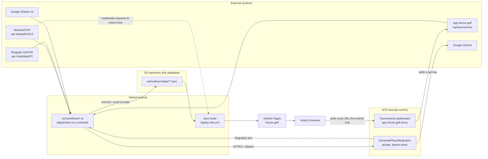

# hector.golf — Technical Architecture

*Last reviewed: 2026-09-15*

## 1. Overview

hector.golf is the public site for the **Hector Trophée**, an invitational amateur golf series
(Hector = team competition, Victor = individual, plus Matchplay and Finnkampen formats). It
publishes event pages, live-ish leaderboards, player profiles with handicap histories, and course
guides at <https://hector.golf>.

The defining architectural property is that **the Git repository is the database**. There is no
runtime server and no request-time API call anywhere in the delivered site. Instead, scheduled
GitHub Actions run TypeScript scripts that scrape external golf systems, write the results as JSON
into `astrosite/src/data/`, and commit that JSON back to `main`. A deploy workflow rebuilds the
Astro site from the committed data and publishes it to GitHub Pages — on every push to `main` that
touches `astrosite/**`, and as a daily backstop from the Cloud Scheduler tick (see §8 for why both
are needed).
Everything a visitor sees was computed at build time.

Three moving parts:

| Part | Location | Role |
| --- | --- | --- |
| Astro site | `astrosite/` | Static site generator, domain logic, committed JSON data, and the workflow scripts |
| Cloud Functions | `backend/backend-functions/` | Four independent HTTP-triggered GCP functions: one public leaderboard proxy, one private biography writer, two dormant experiments |
| CI/CD | `.github/workflows/` | Nine workflows: one deploy, one PR check, four scheduled data updates, two Terraform, one admin deploy |
| Infrastructure | `terraform/` | The `hector-golf` GCP project: Firestore, Cloud Run, IAP, Artifact Registry, CI identities |



Everything except the last two edges runs on a schedule: a data change is a commit, and a commit is
a full rebuild. Those two edges are the exception — the live leaderboard reaches a visitor without
waiting for a deploy.

## 2. Repository layout

```text
.
├── astrosite/                  # Astro 7 site: pages, domain code, JSON data, workflow scripts
│   ├── src/
│   │   ├── pages/              # File-based routing, 15 pages, all prerendered
│   │   ├── components/         # .astro components
│   │   ├── layouts/            # Layout.astro (the only layout)
│   │   ├── styles/             # hector.css — the design system (see §3)
│   │   ├── code/               # Domain layer (not "lib" or "utils")
│   │   ├── schemas/            # Zod schemas; source of truth for all types
│   │   ├── data/               # The database: committed JSON
│   │   ├── workflows/          # Node scripts run by CI, not by the build
│   │   └── content.config.ts   # Astro content collections (mostly unused, see §5)
│   ├── docs/mscorecard-api.md  # Reverse-engineered mScorecard protocol notes
│   ├── scripts/commit-changes.sh
│   └── test/{unit,astro}/
├── backend/backend-functions/  # GCP Cloud Functions gen2 (leaderboard proxy, biography writer, 2 experiments)
├── terraform/                  # The hector-golf GCP project (see docs/current/gcp-setup.md)
├── .github/workflows/          # Nine workflows
└── docs/                       # current/ describes, plans/ proposes, playbooks/ instructs, experiments/ records what was not adopted
```

There is **no monorepo tooling**. `astrosite/` and `backend/backend-functions/` are two independent
npm packages with no shared dependencies, no workspace root, and no cross-package imports. They
communicate only over HTTPS at data-update time.

## 3. The web application (`astrosite/`)

### Stack

Astro 7 with default **static output** — no adapter, no SSR, no `output` setting in
[`astro.config.mjs`](../../astrosite/astro.config.mjs), which is seven lines long and sets only
`site: 'https://hector.golf'` and the React integration. TypeScript 6 (`astro/tsconfigs/strict`),
Zod for all schemas, Vitest 4 for tests, Chart.js for the one interactive widget.

`@astrojs/react` and React 19 are installed and registered as an integration, but **no `.tsx` or
`.jsx` file exists in the repo** and there are zero `client:*` directives anywhere. The integration
is vestigial.

`npm run build` is `astro check && astro build` — type-checking gates the build.

### Routes

Every dynamic route implements `getStaticPaths()`. There is no `pages/api/` and nothing is served at
request time; the one route that is not a page is a JSON file built like any other page (see
*Published data*, below).

| File | Route | Purpose |
| --- | --- | --- |
| `index.astro` | `/` | Landing page: hero, up to three featured live/upcoming events, four cards |
| `404.astro` | `/404` | Custom not-found |
| `events/index.astro` | `/events` | All formats, grouped ongoing / upcoming / past |
| `events/hector/index.astro` | `/events/hector` | Hector events only |
| `events/hector/[slug].astro` | `/events/hector/:id` | The richest page: field, buckets, rounds, winners |
| `events/hector/[slug]/leaderboard.astro` | `/events/hector/:id/leaderboard` | Generated for events with a leaderboard JSON, or configured to poll app.hector.golf |
| `events/hector/[slug]/handicaps.json.ts` | `/events/hector/:id/handicaps.json` | The field and its handicaps, as JSON, for app.hector.golf (see below) |
| `events/matchplay/index.astro` | `/events/matchplay` | Matchplay events |
| `events/matchplay/[slug].astro` | `/events/matchplay/:id` | Single-elimination bracket |
| `players/index.astro` | `/players` | Grid, ranked by a seven-level win comparator |
| `players/[slug].astro` | `/players/:id` | Biography, handicap chart, appearances |
| `courses/index.astro` | `/courses` | Sorted by most recent event played there |
| `courses/[slug].astro` | `/courses/:id` | Description, tee ratings, scorecard, hole grid |
| `courses/[slug]/holes/[hole].astro` | `/courses/:id/holes/:n` | Per-hole page with wraparound nav |
| `golfreport/index.astro` | `/golfreport` | Archive of magazine cover images |
| `brand.astro` | `/brand` | The colour brandbook, generated from the stylesheet (see below) |

### Published data

`/events/hector/:id/handicaps.json` is the one route whose consumer is a program rather than a
person: app.hector.golf reads a Hector's field, its handicaps, and its bucket division from it. It is
built by `src/pages/events/hector/[slug]/handicaps.json.ts` from the payload in
`src/code/field-handicaps.ts`, one file per Hector event, and lands in `dist/` as a real `.json`
file.

Two properties of GitHub Pages are what make a static file usable as an API, and neither is
configured anywhere in this repository:

- it types a response from the file extension, so `.json` is served as `application/json`
- it sends `access-control-allow-origin: *` on every response, so a browser on another origin may
  fetch it without a proxy

An event gives a player two handicaps, and the file carries both because they are the same number
for most of an event's life and diverge for the rest of it:

Each player carries one object per basis — `bucketing` (which also holds `bucket`, the half of the
split they landed in) and `playing` — and each of those is `{ hcp, observed }`:

| | Frozen | `hcp` read from |
| --- | --- | --- |
| `bucketing` | `bucket_freeze` — 08:00 on the first morning, local to the event | The number in the committed event file, which is what the split was computed from |
| `playing` | When the event ends | The observation log, or `getPlayerById` while the event is live |

The bucketing handicap is read from the **committed** event file rather than from the `HectorEvent`
the payload is built from. `populateUpdatedHandicaps` (§6) replaces exactly those numbers with
current ones for any event that is not yet past, which includes every event between its bucket freeze
and its last day — the window in which the two handicaps differ, and the only window in which this
file is being polled. Taking them from the enriched event would publish the playing handicap twice
under two names.

`bucket_freeze` is published as an instant so a consumer can compare it against `generatedAt` and
tell a settled split from a provisional one without reimplementing the rule; `bucketsFreezeAt()` in
`data.ts` is that rule, and `bucketsAreOpen()` is now defined in terms of it so the two cannot drift.

Each basis's `observed` is when we last *asked* the sources about that player — the same question at
the two ends of an event. `handicaps_checked` is the field-wide **guarantee**: the oldest
`playing.observed` in the file, so every handicap in it was checked at least that recently. It is
derived from the entries rather than read from the log a third time, because the latest sweep is a
weaker and different thing — a sweep is field-wide, and the latest one may have skipped somebody in
*this* field, so it could claim a freshness no player in the file had. Null when any player has never
been checked, because then there is no guarantee to make.

Every `observed` is paired with an `approximate` flag, and `handicaps_checked` with
`handicaps_checked_approximate`. True means the sweep behind the instant was reconstructed after the
fact rather than recorded when it ran, so the value is a lower bound — we checked at least that
recently, probably more so. **Render it**: an approximate instant shown as an exact one is worse
than no instant, because the reader cannot tell. Not when the handicap last changed: a handicap that
has not moved since August is no less current for it, and "we checked at 03:02 and it is still 15.4"
is what answers a player whose eBirdie shows something else. Each is read as of the moment its
handicap settled, `bucket_freeze` and the event's last day respectively, because a sweep that ran
after a split settled cannot be what the split was drawn from.

They are instants rather than dates, and deliberately so: the gap this explains is measured in hours
— the Union's WHS batch runs at about 03:00 and re-runs during office hours when the nightly run
fails — and a date cannot show it.

They come from `src/data/handicap-checks.json`, a log of sweeps that `update-handicaps.ts` appends to
on **every** run — `handicaps.json` records what changed, this records that we looked, and a quiet
day is exactly where the two come apart. Entries are `{ at, checked, skipped }`; `skipped` names the
players no source answered for, either because they have no club or because every source failed, so
"we checked everyone" is never claimed on behalf of the player likeliest to ask.

It is append-only and never pruned, like the observation log beside it. A Hector's buckets and the
handicaps they were drawn on are kept for good in the event file, so an explanation that expired
after a season would leave the 2026 split standing in 2036 with nothing left to say about how it came
about. At roughly 57KB a year that is not a file worth trimming — half of what `handicaps.json`
already holds, per decade.

Three consequences worth knowing:

- A quiet sweep now produces a commit and a deploy where it previously produced neither, because
  `commit-changes.sh` commits on any change under `src/data/`. Twice a day, by design.
- A sweep that reached *nobody* is not recorded at all. Its entry would be the whole roster under
  `skipped`, and committing it would deploy the site over a run that learned nothing; an outage
  belongs in the workflow log. `sweepOf()` is that decision, separated from the writing so it can be
  tested without a filesystem.
- `update-handicaps.ts` only sweeps when it is the process entry point. It is imported by the tests
  for `fetchUpdatedPlayerRecords`, and before the guard an import scraped the sources, rewrote the
  buckets, and — once the sweep log existed — appended to committed data every time the suite ran.

Events older than the log publish null for both fields, which is every event until the first sweep
after this shipped.

A past event is frozen at its own dates: the latest reading of a 2014 player's handicap is a fact
about today and says nothing about the golf that was played. A handicap the log cannot reach back to
is published as `null` rather than filled in from a later reading, which for every Hector before 2024
means the whole field. Every field is nullable and none is ever omitted, so a consumer reads the same
shape for a Hector played next month and one played in 2014.

Freshness is deploy cadence, not live: handicaps reach the repository twice a day (§8), and the file
is rebuilt when that commit deploys. A consumer needing the value at the moment a round starts is
asking the wrong system.

### Layers

- **`src/schemas/`** — Zod schemas (`events.ts`, `players.ts`, `courses.ts`, `handicaps.ts`). Types
  are derived with `z.infer`; these schemas are the single source of truth for both validation and
  typing.
- **`src/code/`** — the domain layer. `data.ts` (loading), `events.ts`, `players.ts`, `courses.ts`,
  `stats.ts`, `dates.ts`, `rounds.ts`, `scoring.ts`, `strings.ts`, `palette.ts`, plus the
  `handicaps/` and `leaderboards/` integration subpackages and the standalone `mscorecard/` SDK.
- **`src/components/`** — `.astro` components grouped by domain (`courses/`, `events/`, `players/`,
  `golfreport/`) plus the shared shell pieces at the top level: `PageHeader`, `Card`, `Breadcrumb`,
  `Highlight`, and the trophy marks `HectorMark` / `VictorMark` / `MatchplayMark` behind
  `CompetitionMark`.
- **`src/styles/hector.css`** — the design system, imported once by the layout. See below.
- **`src/layouts/Layout.astro`** — the only layout. Carries the Google Tag Manager bootstrap
  (`GTM-56L7SB92`), `<meta name="robots" content="noindex,follow">`, a `published-at` build
  timestamp, the favicon/manifest links and the Google Fonts stylesheet, and the sticky site header
  and footer. `public/robots.txt` also disallows everything — the site is deliberately not indexed.

**`src/code/mscorecard/`** is a self-contained SDK and CLI for mscorecard.com, reverse engineered
from the iOS app's traffic and documented in
[`astrosite/docs/mscorecard-api.md`](../../astrosite/docs/mscorecard-api.md). It is not part of the
site: nothing under `src/pages/`, `src/components/` or `src/workflows/` imports it, no npm script
runs it, and it reaches the network only when a developer invokes
`npx tsx src/code/mscorecard/cli/main.ts` with `MSCORECARD_EMAIL` / `MSCORECARD_PASSWORD` set. It
shares the repository, and `src/code/scoring.ts`, with the site — nothing else.

### The design system

The site shares a visual language with the scorecard app at <https://app.hector.golf>, and
[`src/styles/hector.css`](../../packages/ui/styles/hector.css) is where that language lives: ~780
lines holding the token set, a small reset, base typography, and the component primitives that pages
compose from — `.card`, `.pill`, `.btn`, `.chip-num`, `.num`, `.score`, `.label`, `.eyebrow`,
`.table-scroll`, `.page`, `.section`, `.grid`, `.segmented`, `.breadcrumbs`. Palette, type scale and
primitives mirror the app's Tailwind theme one-to-one.

It is imported exactly once, by `Layout.astro`; pages and components add only their own scoped
`<style>` blocks on top. There is no longer a single global breakpoint — components declare their
own — and the stylesheet honours `prefers-reduced-motion`.

**Colour carries meaning, and the meanings do not overlap.** Ink (`--ink-50` … `--ink-950`) is the
neutral scale everything sits on, biased slightly toward violet rather than being a flat grey.
Violet is reserved for the *interface*: links, buttons, focus, selection, active navigation. Each
competition therefore gets a hue of its own, so a competition colour can never be mistaken for
interface state:

| Token | Hue | Stands for |
| --- | --- | --- |
| `--hector` / `--hector-soft` | gold, ~42° | The Hector pairs competition; also the wordmark and page eyebrows |
| `--victor` / `--victor-soft` | fairway green, ~99° | The Victor individual competition |
| `--matchplay` / `--matchplay-soft` | ember, ~17° | Matchplay |

The greens are deliberately kept apart: Victor's fairway green sits well clear of the `--emerald-400`
that means "live". The `-soft` tone of each pair is one step lighter, for type and figures small
enough that the base tint would strain.

**Trophy marks are components, not images.** `HectorMark`, `VictorMark` and `MatchplayMark` are
inline SVG drawn in `currentColor`, and [`CompetitionMark`](../../packages/ui/components/CompetitionMark.astro)
is the single place that pairs a competition with both its shape and its tint — so a Victor trophy
cannot come out gold on one page and ember on another. `WinBadge` replaced the three near-identical
`players/icons/*WinIcon.astro` components, which had drifted into rendering every trophy in the same
gold.

[`PageHeader`](../../packages/ui/components/PageHeader.astro) is the standard masthead — gold eyebrow,
serif display title, mono metadata strip, optional lede. Every page uses it, directly or through
`EventList`, except the landing page (which has a bespoke hero), the 404 and the per-hole page. Its
metadata parts are laid out as flex items rather than one joined string, so a date range wraps as a
whole unit instead of being chopped mid-range.

### The brandbook is generated, not written

[`/brand`](../../astrosite/src/pages/brand.astro) documents the palette, and it is built *from* the
stylesheet rather than describing it. [`src/code/palette.ts`](../../astrosite/src/code/palette.ts)
parses the `:root` block out of `hector.css?raw` at build time, follows `var()` chains to real
values, and computes hex, RGB, hue angle and WCAG contrast against the page ground. Every figure on
the page is measured, every swatch paints with `var(--token)`, and the specimens are the real
components — so the brandbook cannot drift from the site.

[`test/unit/palette.test.ts`](../../astrosite/test/unit/palette.test.ts) then asserts the palette's
rules against the shipped stylesheet: every competition colour stays legible on the page ground, the
three stay far apart in hue, the par colours read as one set, Victor stays clear of the "live"
emerald, and violet never stands for a competition. Changing a colour in `hector.css` can fail the
test suite.

### Client-side JavaScript

The delivered site is essentially static HTML. There is no state management, no router, and no
search. Four pieces of client JS exist in total:

1. **Handicap chart** — [`HandicapHistoryChart.astro`](../../astrosite/src/components/players/HandicapHistoryChart.astro)
   renders a `<canvas>` carrying the last 20 handicap entries in `data-` attributes, and loads
   [`HandicapHistoryChart.ts`](../../astrosite/src/components/players/HandicapHistoryChart.ts) (bundled
   by Astro) which draws a Chart.js time series with a custom `afterRender` plugin painting the
   current handicap in a gold filled circle. Being a bundled TS module rather than a stylesheet, it
   is the one place that restates the palette's hex values by hand (see §13).
2. **Bracket connectors** — [`SingleEliminationBracketV2.astro`](../../astrosite/src/components/events/SingleEliminationBracketV2.astro)
   pulls `leader-line` from cdnjs (SRI-pinned, `is:inline`) and draws connector lines between match
   elements on `DOMContentLoaded`.
3. **Leaderboard auto-refresh** — for a Sheets-managed event, the leaderboard page runs a
   `setInterval` that hard-reloads with a cache-busting query string every five minutes. An
   app.hector.golf-managed event gets [`LiveLeaderboard.astro`](../../astrosite/src/components/events/LiveLeaderboard.astro)
   instead, which polls the leaderboard proxy (§10) and rewrites the rendered rows in place, cloning
   the component's own row template so the replacements keep their scoped styles. It also keeps the
   last standings it read in `localStorage`
   ([`live-cache.ts`](../../astrosite/src/code/leaderboards/live-cache.ts)) and paints them before
   the first request goes out, so a page reloaded mid-round opens on a timestamped board rather than
   on the build's "play has not started" notice. A cached board is only ever the first frame: it is
   declined when it is over 48 hours old — a weekend, the shape of the event — when the build
   published fresher standings than the cache holds, or when anything about the entry is doubtful,
   and it is rolled back to the published empty state if the tournament itself then answers
   `upcoming`.

   Two details keep that board honest, and one keeps it from flashing. The status line prints the
   timestamp the standings carry, and once they are more than five minutes old it also prints how
   far behind they are, in amber — a board nothing is refreshing has to stop reading like a live
   one, so `--amber-400` (registered on `/brand`) now means exactly that. Polling never makes two
   round trips within ten seconds, whatever asks for one: the thirty-second interval already
   respected that, but returning to the tab reads immediately, and a tab being switched to and from
   is not a reason for the proxy to answer ten times a minute; a request refused by that floor is
   rescheduled, not dropped. And because the empty state is server-rendered, it is painted long
   before the island's module has loaded — so a hand-written inline script, running during
   parsing, marks the boards `data-cache-pending` when this browser has an entry for the event,
   and CSS holds the message back (opacity, keeping the row's box) until the module has had its
   say, or for 500ms if it never loads.
4. **Google Tag Manager** — the inline bootstrap in `Layout.astro`.

## 4. Data model

All content lives as JSON committed under [`astrosite/src/data/`](../../astrosite/src/data/):

| Path | Count | Written by | Contents |
| --- | --- | --- | --- |
| `players/*.json` | 45 | Human + CI | Identity, contact, club, current handicap, `misc` hints, AI-generated `biography[]` |
| `events/hector/*.json` | 13 | Human + CI | `HECTOR2014`–`HECTOR2026` |
| `events/matchplay/*.json` | 3 | Human | `HECTORMATCHPLAY2024`–`2026` |
| `events/finnkampen/*.json` | 2 | Human | `FINNKAMPEN2021`–`2022` |
| `courses/*.json` | 17 | Human | Tees, ratings, slope, scorecard, per-hole descriptions |
| `leaderboards/*.json` | 6 | CI only | Per-event Hector and Victor standings |
| `handicaps.json` | ~1,400 entries | CI only | Append-only `{player, date, handicap, observed?}` log of observations. A day can hold more than one entry when the Golf Union re-runs a failed batch; `latestPerDay()` is the daily view every reader goes through — see [handicap-updates.md](./handicap-updates.md) |
| `clubs.json` | 140 clubs | CI only | Finnish golf clubs `{name, abbreviation, sources[]}` |

### Events are a discriminated union

`Event` is a Zod discriminated union on `format`
([`src/schemas/events.ts`](../../packages/schemas/src/events.ts)), with `hectorEventSchema`,
`matchplayEventSchema`, and `finnkampenEventSchema` extending a shared `BaseEventSchema`. Hand-written
type guards `isHectorEvent` / `isMatchplayEvent` / `isFinnkampenEvent` live in
[`src/code/data.ts`](../../astrosite/src/code/data.ts).

**The directory name must equal the `format` discriminator**, because `pathToEventJson()` builds the
write path as `../data/events/${event.format}/${event.id}.json`.

### Event dates are structured, not prose

`BaseEventSchema` carries `timing: { start, end }`, two ISO calendar dates (`"2026-09-24"`) validated
by `isValidIsoDate` and refined so an event cannot end before it starts. A one-day event repeats the
same date on both sides, so there is no "no end date" case for a reader to forget about.

This replaced a single `date` string holding prose — `"September 24-27, 2026"` — which was easy to
write and hard to use: the date a given round is played is arithmetic on the start date, and
arithmetic wants a date rather than a sentence to parse. The refinement lives on the `timing` object
rather than on the event because `z.discriminatedUnion` rejects an option carrying one.

### Scoring rules are data, not code

The Hector event schema encodes the competition rules declaratively: `rounds[].gameFormats[]` carries
a `format` enum (Stableford NET/SCR, Stroke Play, Better Ball, Scramble…), `handicapAllowance`,
`contribution: {hector, victor}` fractions, `teamContribution: 'both' | 'better' | 'team'`, and
`birdieBonus` / `eagleBonus`.

`RoundsList.astro` renders these into English prose ("Hector points: 33% of the better individual's
score"). **Nothing in this repository computes scores from them** — actual scoring happens in the
external scoring systems (Google Sheets or app.hector.golf), and only the resulting standings are
imported.

### Player identity

A player's `id` is not derived from the filename: `players/lasse-koskela.json` has `"id": "lasse-k"`.
All lookups go through `id`; the filename is incidental. Players may carry `aliases[]` (alternative
spellings used by external scoring systems) and `privacy: 'shorten-last-name'`.

## 5. Data access — two parallel mechanisms

This is the most surprising part of the codebase and the easiest place to make a wrong assumption.

### (a) Astro content collections — declared, mostly unused

[`src/content.config.ts`](../../astrosite/src/content.config.ts) defines three collections — `courses`,
`players`, `events` — with the `glob()` loader and the Zod schemas.

Only **`courses`** is ever read, by four pages. The two `courses/[slug]` pages call `getCollection`
solely to produce `getStaticPaths()`, then re-fetch the actual data through `getCourseById()`;
`courses/index.astro` reads it for real, and `brand.astro` pulls a course from it for one specimen.
The `players` and `events` collections are declared and never read by anything.

### (b) `src/code/data.ts` — the path actually used

At module load, using top-level `await`, it globs the JSON, `safeParse`s each file, and drops
anything that fails validation:

```ts
export const eventsData: Event[] = (await glob("src/data/events/**/*.json"))
    .map((filePath) => EventSchema.safeParse(JSON.parse(readFileSync(filePath, "utf-8"))).data)
    .filter(nonUndefined);
```

`eventsData`, `hectorEvents`, `playersData`, and `coursesData` are **module-level singletons shared
across the entire build**. Two consequences worth internalising:

- **Glob paths are relative to the working directory**, not to the module. Every command — build,
  tests, workflow scripts — must be run from `astrosite/`.
- **The singletons are mutated in place.** `populateMissingParticipants()` and
  `populateUpdatedHandicaps()` in [`src/code/events.ts`](../../astrosite/src/code/events.ts) modify
  the shared event objects, so their effects persist across every page rendered later in the same
  build.

A **third** mechanism exists in
[`src/code/leaderboards/leaderboards.ts`](../../astrosite/src/code/leaderboards/leaderboards.ts): it
uses `import.meta.glob` for discovery, rewrites the resulting keys into CWD-relative paths, then
reads the files with `readFileSync`.

Validation failures are silent. A malformed data file does not fail the build — it simply vanishes
from the site.

## 6. Build-time derivation

A significant amount of logic runs during `astro build` rather than being precomputed into the data
files:

- **Current handicap** — `getPlayerHandicapById()` sorts `handicaps.json` by date and takes the last
  entry. `getPlayerById()` then applies `player.handicap || handicapFromHistory`, so the JSON field
  acts as a manual override of the scraped history — except that `update-handicaps.ts` also *writes*
  that field, so the override is overwritten by what it overrides. See
  [data-ownership.md](./data-ownership.md), which settles who owns which field and why the fix waits
  for the Firestore migration.
- **Projected buckets** — for *future* Hector events only, `populateUpdatedHandicaps()` refreshes the
  stored bucket handicaps from the live history, so "Projected Buckets" stay current between
  scheduled data runs. "Future" here means before 08:00 on the first morning in the event's own time
  zone (`bucketsAreOpen` in `data.ts`), not before the first date: the Draft after round one reads
  these, so they must not move once play has begun.
- **Participant back-fill** — if `participants` is empty, `populateMissingParticipants()`
  reconstructs it from `results.teams[].players` or from the matchplay bracket's `left`/`right`.
- **Winner inference** — `events/hector/[slug].astro` promotes the top leaderboard row to
  Hector/Victor champion when the event JSON records no winners *and* every leaderboard entry reads
  `through === "F"`.
- **Leaderboard enrichment** — `enrichLeaderboard()` splits the stored display strings
  (`"Lasse Koskela + Jari Kuusela"`) with `splitCompetitorNames()`, which accepts `+` or `&` because
  Sheets and app.hector.golf disagree on the separator, and resolves each name back to a `Player`
  through an index built from full names, privacy-shortened names, and all aliases. It normalises
  `through` to `"F"` when complete and synthesises anonymous `"Team N"` placeholders before play
  starts.
- **Positions** — `leaderboardPosition()` computes `1` / `T3` ranks honouring the per-competition
  scoring direction (`hector: ascending` because it counts strokes; `victor: descending` because it
  counts Stableford points). It lives in `leaderboards/presentation.ts` alongside the score, diff and
  `through` formatters, so the statically rendered board and the live one cannot drift apart — that
  module is free of `fs` and Zod precisely so the browser can import it.
- **Chronological grouping** — `getAllEventsGroupedByChronology()`, with the special rule that a
  matchplay event holding a recorded winner counts as past regardless of its dates.
- **Date formatting** — events store ISO dates, so the derivation now runs the other way:
  `formatEventDates()` / `formatDateRange()` in [`dates.ts`](../../packages/schemas/src/dates.ts) render
  `timing` into display prose, and the chronology predicates (`eventHasStarted`, `isPastEvent`,
  `yearOfEvent`) are plain string or `Date` comparisons on `timing.start` / `timing.end` rather than
  regex-matching a sentence.
- **Round scheduling** — a round records a `day` offset into the event, not a date.
  [`rounds.ts`](../../astrosite/src/code/rounds.ts) turns that into a real date (`dateOfRound()`,
  day 1 being the event's first day) and into a title (`titleOfRound()` → "Saturday morning"). The
  part of day is inferred from the round's position within its day, and a day holding a single round
  is named by its weekday alone rather than being guessed into a "morning".
- **Privacy name shortening** — for players marked `privacy: 'shorten-last-name'`, a singleton in
  [`players.ts`](../../astrosite/src/code/players.ts) computes the *shortest unique last-name prefix*
  among players sharing a first name, so "Lasse Koskela" renders as "Lasse K" while two Johns would
  become "John De" / "John Di".
- **Player ranking** — `players/index.astro` sorts with a seven-level comparator: total wins →
  Hector wins → Victor wins → Matchplay wins → most recent win → most recent start → start count →
  name.

## 7. External integrations

| System | Module | Auth | Purpose |
| --- | --- | --- | --- |
| WiseGolf | `code/handicaps/wisegolf-api.ts` | Username/password → bearer token | Official WHS handicaps, club directory, club membership |
| Ringside Golf | same module | Same token | Second player-lookup endpoint |
| Google Sheets v4 | `code/leaderboards/google-sheets.ts` | `leaderboard-reader` by Workload Identity Federation, via ADC | Live leaderboards for sheet-managed events |
| app.hector.golf | `code/leaderboards/app.ts` | `x-api-key` | Live leaderboards for app-managed events |
| app.hector.golf (browser) | `code/leaderboards/app-payload.ts` | None — via the `TournamentLeaderboard` proxy (§10) | The same standings, polled from the visitor's browser |
| GitHub Contents API | `code/leaderboards/github.ts` | `GITHUB_ACCESS_TOKEN` (Octokit) | Commits leaderboard JSON directly |
| Google Gemini | via `GeneratePlayerBiography` (§10) | Bearer (`ASTROSITE_API_KEY`) | Player biography prose. Two further Gemini functions exist and are dormant — `docs/experiments/` |

Notable details:

- **`HandicapSource` interface** —
  [`handicap-source-api.ts`](../../astrosite/src/code/handicaps/handicap-source-api.ts) defines
  `getPlayerHandicap`, `resolveClubMembership`, and `getClubs`, plus a `NullHandicapSource`
  fallback. `update-handicaps.ts` pops sources off a list and falls through on failure, so adding a
  second provider is a matter of implementing the interface.
- **WiseGolf client** uses `fetch-h2` with browser-mimicking headers, `micro-memoize` (15-minute TTL
  on the login, longer on club lists), and `p-ratelimit` throttling (5 req/s, concurrency 1).
- **It calls `process.exit(1)` at import time** when `WISEGOLF_USERNAME` / `WISEGOLF_PASSWORD` are
  missing. This is why the deploy workflow and the test suite both need WiseGolf credentials even
  though neither performs a handicap fetch.
- **Google Sheets access is layout-tolerant**: rather than fixed ranges, `google-sheets.ts` searches
  the `LEADERBOARD` tab for anchor cells (`findCellContaining`, `findCellBelowContaining`,
  `findEmptyCellBelow`) and derives the data range from them.
- **app.hector.golf responses are read strictly on the write path and loosely in the browser.**
  `app.ts` Zod-validates the payload in full before anything can be written to a data file and
  published; `app-payload.ts` checks only the fields it renders, because a payload the browser does
  not recognise costs a viewer one live update rather than corrupting stored results. Both share the
  same extractors, so the field mapping is defined once, and both project down into the
  `GoogleSheetTeamLeaderboard` / `GoogleSheetIndividualLeaderboard` shapes the Sheets path produces,
  so everything downstream is source-agnostic.

## 8. The data pipeline

This is how the system is actually operated.

```mermaid
sequenceDiagram
    autonumber
    participant Sched as Cloud Scheduler
    participant Admin as hector-admin (Cloud Run)
    participant Cron as GitHub Actions
    participant Script as src/workflows/*.ts
    participant Ext as External APIs
    participant Tree as Working tree
    participant Repo as main branch
    participant Deploy as deploy-site.yml
    participant Pages as GitHub Pages

    Sched->>Admin: POST /api/workflows/handicaps/dispatch (03:00 / 12:00 UTC)
    Admin->>Cron: POST /actions/workflows/…/dispatches
    Note over Sched,Cron: The workflows' own `schedule:` crons were deleted<br/>on 2026-09-16; the tick is the only clock (see below)
    Cron->>Script: npx tsx
    Script->>Ext: fetch handicaps / leaderboards / biographies
    Ext-->>Script: JSON
    Script->>Tree: write src/data/**.json
    Script->>Tree: write .update-*-commit sidecar message
    Cron->>Tree: scripts/commit-changes.sh
    Tree->>Repo: git commit -F … && git pull -r && git push
    Note over Repo,Deploy: GITHUB_TOKEN push triggers no workflow<br/>(a human push here would deploy directly)
    Cron->>Deploy: so a scrape dispatches the deploy instead
    Deploy->>Repo: checkout
    Deploy->>Pages: astro build → actions/deploy-pages
```

### Three mechanics that explain the design

**GitHub's `schedule` trigger does not keep time, so it is no longer the one used.** Scheduled events
are queued and delivered when GitHub has capacity. Measured across the last 300 scheduled runs of
`update-handicaps.yml`, not one started on time:

| Month | Median lateness, 03:00 slot | 13:00 slot |
| --- | --- | --- |
| 2026-04 | 2h22m | 1h28m |
| 2026-06 | 4h13m | 2h52m |
| 2026-09 | 4h32m | 3h46m |

`workflow_dispatch` has no such queue. So [`terraform/scheduler.tf`](../../terraform/scheduler.tf)
runs **two** Cloud Scheduler jobs — every two hours from 03:00 to 07:00 UTC, and once at 12:00 UTC.
They are
the one thing in this project not in `europe-north1` — Cloud Scheduler does not run there, so they
sit in `europe-west1`. Each calls one endpoint on the admin service — `POST /api/workflows/dispatch`
— which starts every workflow marked `scheduled` in
[`admin/src/lib/workflows.ts`](../../admin/src/lib/workflows.ts), using a GitHub token read from
Secret Manager.

The split is deliberate: **when** lives in Terraform, where `gcloud scheduler jobs list` answers it
without anyone reading TypeScript, and **what** lives in the application, so adding a workflow to the
twice-daily run needs no infrastructure change at all. Two jobs rather than one per workflow also
keeps the project inside Cloud Scheduler's three-job free tier.

`POST /api/workflows/<slug>/dispatch` starts a single workflow, and is what the **Run now** buttons
on the admin's `/operations` page use — for a scrape needed between the scheduled times, or when the
association published handicaps too late for the midday run to see them. That page also shows a log
of recent runs with start times to the second: a repeating `03:00:xx` down the column is how a reader
knows when the next scheduled run is due, without this code keeping its own copy of the schedule to
disagree with Terraform's.

**There are no `schedule:` blocks left.** They were deleted on 2026-09-16 and the tick is now the
only clock. They had been kept as a backstop, and the backstop cost more than it bought: every
workflow had two clocks, one of them hours late — measured that day, the last scheduled delivery of
each was between two and five hours late, and `update-player-club-memberships` landed on the wrong
calendar day — and its runs were duplicates somebody had to explain every time they read the Actions
tab.

The cost is stated plainly because it is real: **if Cloud Scheduler or the admin service is down,
nothing runs, and nothing goes red to say so.** Before, a broken admin meant late rather than absent.
The replacement for redundancy is that the tick fires four times a day and the Operations page shows
when each workflow last ran.

Two scrapes can still overlap — the tick starts them within a second of each other — so all four
update workflows share one `concurrency` group, `data-update`. They all end in the same
`git pull -r && git push`, and the staggered start times that used to keep them apart were never more
than a guess about how long each one takes.

**Not everything on the tick runs on every tick.** `SCHEDULED_WORKFLOWS` is what the tick
*considers*; [`admin/src/lib/cadence.ts`](../../admin/src/lib/cadence.ts) decides which are due, by
asking GitHub when each last started. Handicaps and leaderboards want every tick; the two player
scrapes want roughly monthly; the deploy wants a day. That is what lets a fortnightly job share a
tick with a four-times-daily one without a second Cloud Scheduler job — the free tier allows three
and this project spends two.

An interval rather than a cron because a cron cannot be matched against a tick it does not fire on:
`30 2 10,25 * *` has minute 30 and every tick is at minute 0. An interval is also self-healing, which
is what the backstop used to provide — "it has been 15 days" stays true through a missed tick.

**The deploy has three triggers, and the cron is not the main one.** `deploy-site.yml` runs on every
push to `main` whose changes touch the site or anything it builds from — `astrosite/**`,
`packages/**`, the root manifest and lockfile, `.node-version`, or `.github/workflows/**` — so
ordinary human commits, a new event JSON or a component change, rebuild and publish the site
immediately.

Push cannot cover commits made by the data pipeline itself: pushes authenticated with `GITHUB_TOKEN`
deliberately do not trigger further workflows, so the automated data commits cannot set off
`deploy-site.yml`. That case is handled by dispatch rather than by the clock. A scrape that has just
committed calls [`request-deploy`](../../.github/actions/request-deploy/action.yml), which asks the
admin service to dispatch `deploy-site.yml` — it is in `DISPATCHABLE_WORKFLOWS` in
[`admin/src/lib/workflows.ts`](../../admin/src/lib/workflows.ts) for exactly this — so a scrape
publishes within a minute of finishing rather than waiting for a fixed time after it.

The backstop under both of those, for the day the dispatch fails, used to be a `0 8,13` cron in the
workflow. It is now a one-day interval on the deploy's entry in `DISPATCHABLE_WORKFLOWS`: the tick
dispatches `deploy-site.yml` only when no deploy has happened in 24 hours, which is to say only when
the normal path is already broken. Same backstop, expressed in the mechanism that replaced the
crons.

**Why `update-leaderboards` is different.** Alone among the four, it writes its output through the
**GitHub Contents API** (Octokit `createOrUpdateFileContents` against
`astrosite/src/data/leaderboards/<eventId>.json`) rather than into the local working tree. Those
commits bypass `commit-changes.sh` entirely. Only its secondary effect — back-filling `results.teams`
into the event JSON — goes through the normal working-tree path.

### The commit-back script

[`scripts/commit-changes.sh`](../../astrosite/scripts/commit-changes.sh) is shared by all four update
workflows:

1. Exits 0 immediately unless `git status --short` shows modified files under `src/data/`.
2. Builds a commit message from `$GITHUB_WORKFLOW`, `$GITHUB_EVENT_NAME`, `$GITHUB_RUN_NUMBER`.
3. Appends the contents of the sidecar files each workflow script leaves behind
   (`.update-handicaps-commit`, `.update-player-biographies-commit`), then deletes them.
4. Stages exactly the changed data files, lists them in the message, then
   `git commit -F … && git pull -r && git push`.

This is the source of the `Github Action: Update players' official handicaps` commits that dominate
the history.

### The workflow scripts

| Script | Schedule (UTC) | Reads | Writes |
| --- | --- | --- | --- |
| `update-handicaps.ts` | Every two hours 03:00–07:00, and 12:00, by Cloud Scheduler. No cron | WiseGolf | `handicaps.json`, `players/*.json`, event `buckets` |
| `update-leaderboards.ts` | Every two hours 03:00–07:00, and 12:00, by Cloud Scheduler. No cron | Sheets / app.hector.golf | `leaderboards/*.json` (via API), event `results.teams` |
| `update-player-biographies.ts` | `30 2 10,25 * *` | GCP function, WiseGolf | `players/*.json` `biography`, `clubs.json` |
| `update-player-club-memberships.ts` | `15 22 15 * *` | WiseGolf | `players/*.json` `club` |

**`update-handicaps.ts`** — the largest at 310 lines. For each player holding a `club`, it fetches
the current handicap through the source chain and appends changed values to `handicaps.json`
(replacing a same-day duplicate if the association re-ran a batch). It then re-sorts each upcoming
event's participants with `sortPlayersForBucketing` — by current handicap, tie-broken so that a
player whose handicap is *falling* ranks ahead of one whose is rising — and splits them into two
equal buckets written back into the event JSON. `getPlayerHandicapFromHistory` and
`sortPlayersForBucketing` are exported specifically so the unit tests can import them.

**`update-leaderboards.ts`** — selects Hector events that hold a `leaderboardSheet` URL and have
already started (`updateFutureEvents = false`), then dispatches on the URL shape: `app.hector.golf/*`
against the app API, `docs.google.com/spreadsheets/*` against Sheets. It also back-fills
`results.teams` into the event JSON from leaderboard pairings when the event has none recorded yet.

**`update-player-biographies.ts`** — assembles a `PlayerBiographyInput` per player (name, gender,
home club resolved through `clubs.json`, past appearances, Hector/Victor wins, `misc` details, the
next event and whether they are playing it, a `retired` flag when more than seven events have passed
since their last appearance, and **the biographies already generated in this run** so the model
avoids repeating phrasing) and POSTs it to the `GeneratePlayerBiography` Cloud Function. As a side
effect it regenerates `clubs.json` by merging the club lists from all handicap sources.

**`update-player-club-memberships.ts`** — for players with no `club`, searches every source by name
and assigns a club **only when exactly one** club matches.

## 9. CI/CD

| Workflow | Trigger | Runs | Permissions |
| --- | --- | --- | --- |
| `deploy-site.yml` | Push to `main` touching `astrosite/**`, `packages/**`, the root manifest/lockfile, `.node-version`, or any workflow; dispatched by the admin service after a data update, and by the tick when no deploy has happened in a day; manual | `npm ci` → `astro build` → `actions/deploy-pages@v5` | `contents: read`, `pages: write`, `id-token: write` |
| `check-site.yml` | PRs targeting `main` touching `astrosite/**`, `packages/**`, the root manifest/lockfile, `.node-version`, or this file | `npm ci` → `npm test` → `npm run build` | `contents: read` |
| `check-admin.yml` | PRs targeting `main` touching `admin/**`, `packages/**`, the root manifest/lockfile, `.node-version`, `.dockerignore`, or this file | `npm ci` → test → build → `docker build` of `admin/Dockerfile` | `contents: read` |
| `check-backend.yml` | PRs targeting `main` touching `backend/**` or this file | `npm ci` → `npm test` → `npm run typecheck` in `backend/backend-functions` | `contents: read` |
| `check-markdown.yml` | PRs targeting `main` touching any `**/*.md`, `.markdownlint-cli2.jsonc`, or this file | root-only `npm ci` → `npm run lint:md` over every `.md` in the repository | `contents: read` |
| `update-handicaps.yml` | Dispatched by the admin service on every tick; manual | Script + `commit-changes.sh` | `contents: write` |
| `terraform-plan.yml` | PRs touching `terraform/**` | `fmt` → `init` → `validate` → `plan`, posted as a PR comment | `contents: read`, `id-token: write`, `pull-requests: write` |
| `terraform-apply.yml` | Push to `main` touching `terraform/**`; manual | `terraform apply`, gated by the `infrastructure` environment | `contents: read`, `id-token: write` |
| `deploy-admin.yml` | Push to `main` touching `admin/**`, `packages/**`, the root manifest/lockfile, `.node-version`, `.dockerignore`, or this file; manual | Build, push to Artifact Registry, `gcloud run deploy` | `contents: read`, `id-token: write` |
| `deploy-functions.yml` | Push to `main` touching `backend/backend-functions/**`; manual | `gcloud functions deploy` for each of the four functions, in parallel, with `--service-account` and `--set-secrets` | `contents: read`, `id-token: write` |
| `update-leaderboards.yml` | Dispatched by the admin service on every tick; manual | Script + `commit-changes.sh` | `contents: write` |
| `update-player-biographies.yml` | Dispatched by the admin service when it last ran 15+ days ago; manual | Script + `commit-changes.sh` | `contents: write` |
| `update-player-club-memberships.yml` | Dispatched by the admin service when it last ran 30+ days ago; manual | Script + `commit-changes.sh` | `contents: write` |
| `export-admin-data.yml` | Manual only — an export publishes an edit, so there is no cron | Guard on `GH_WIF_PROVIDER`/`GH_DEPLOYER_SA` → `npm ci` → WIF auth → `npm run export` in `admin/` → `git add -A astrosite/src/data/events/matchplay` and push | `contents: write`, `id-token: write` |
| `refresh-admin-mirror.yml` | `workflow_run` completion of the four update workflows, successful runs only; manual | Same guard → `npm ci` → WIF auth → `npm run seed` in `admin/` | `contents: read`, `id-token: write` |

**Deployment target is GitHub Pages**, with the custom domain supplied by
[`public/CNAME`](../../astrosite/public/CNAME) (`hector.golf`; `www` 301s to it). The build step passes
`--site ${{ steps.pages.outputs.origin }} --base ${{ steps.pages.outputs.base_path }}` so the Pages
environment determines the final URLs, and uses concurrency group `pages` with
`cancel-in-progress: false`.

The four update workflows share an identical boilerplate skeleton, including a vestigial "Detect
package manager" step that always resolves to npm.

Dependabot is active (see the merged `Bump the npm_and_yarn group…` commits) but runs from the
repository's security settings — there is no `.github/dependabot.yml`.

**`deploy-functions.yml` deploys configuration, not only code.** Every deploy passes
`--service-account` and `--set-secrets`, so a function's identity and its three keys are whatever
the workflow states rather than whatever the last laptop deploy happened to set. `--set-secrets`
names a Secret Manager container rather than a value, so no key passes through this repository, a
GitHub secret or a CI runner — and rotating one is `gcloud secrets versions add` alone, since the
functions reference `:latest`.

It federates through `GH_WIF_PROVIDER`, the same pool every other workflow here uses, as
`functions-deployer@`. There is no second pool and no `GH_FUNCTIONS_WIF_PROVIDER`.

Until 2026-09-14 none of that was true: the functions ran in the `gen-lang-client-*` project, this
workflow shipped inert behind a guard job, and it deliberately passed no environment variables at
all because the only way to set one was `--set-env-vars` from somebody's `.env`. Both constraints
were consequences of the project split, which
[functions-migration.md](../plans/functions-migration.md) closed.

### Secrets and variables

[gcp-bootstrapping.md](../playbooks/gcp-bootstrapping.md) is where the values come from and what
their absence degrades; this is what reads them.

| Name | Kind | Used by |
| --- | --- | --- |
| `GH_WIF_PROVIDER` | Variable | every job that touches GCP — both Terraform workflows, `deploy-admin`, `deploy-functions`, the four update workflows, `export-admin-data`, `refresh-admin-mirror` |
| `GCP_PROJECT_ID` | Variable | the same set minus the two Terraform workflows, which get the project from their backend config |
| `GCP_REGION` | Variable | `deploy-admin`, `deploy-functions` |
| `GH_DEPLOYER_SA` | Variable | `deploy-admin`, `export-admin-data`, `refresh-admin-mirror` — the identity they federate to |
| `GH_TERRAFORM_SA` | Variable | `terraform-plan`, `terraform-apply` — the identity they federate to |
| `GH_LEADERBOARD_SA` | Variable | `update-leaderboards` — the identity it federates to |
| `GH_FUNCTIONS_DEPLOYER_SA` | Variable | `deploy-functions` — the identity it federates to |
| `GH_FUNCTIONS_RUNTIME_SA` | Variable | `deploy-functions` — what it passes to `--service-account` |
| `GH_FUNCTIONS_BUILDER_SA` | Variable | `deploy-functions` — what it passes to `--build-service-account` |
| `GH_IMAGE_REPO` | Variable | `deploy-admin` — the Artifact Registry repository the image is tagged into |
| `TF_ADMIN_DOMAIN` | Variable | both Terraform workflows; also the four update workflows, which pass it to `request-deploy` |
| `TF_LEADERBOARD_IMPERSONATORS` | Variable (a JSON array) | `terraform-plan`, `terraform-apply` |
| `TF_ADMIN_PRINCIPALS` | Secret (a JSON array) | `terraform-plan`, `terraform-apply` — a secret only because the repository is public and these are real addresses |
| `TF_IAP_OAUTH_CLIENT_ID` | Secret | both Terraform workflows; also the four update workflows, which pass it to `request-deploy` |
| `TF_IAP_OAUTH_CLIENT_SECRET` | Secret | `terraform-plan`, `terraform-apply` |
| `PUBLIC_LEADERBOARD_PROXY_URL` | Variable | `deploy-site`, `check-site` — absent, live leaderboards drop out of the build |
| `WISEGOLF_USERNAME` | Secret | deploy, PR checks, three update workflows |
| `WISEGOLF_PASSWORD` | Secret | deploy, PR checks, three update workflows |
| `HECTOR_APP_API_KEY` | Secret | `update-leaderboards`, `check-site` |
| `ASTROSITE_API_KEY` | Secret | `update-player-biographies` |
| `GIT_COMMITTER_EMAIL` | Secret | the four update workflows and `export-admin-data` — the address they commit as |
| `GITHUB_TOKEN` | Built-in → `GITHUB_ACCESS_TOKEN` | `update-leaderboards` |

The four update workflows reach beyond their own scrape because each ends in the `request-deploy`
composite action: a push made with `GITHUB_TOKEN` does not trigger workflows, so they ask the admin
service to dispatch the deploy instead — which is why an IAP client id and the admin domain appear
in a handicap scrape.

## 10. The backend (`backend/backend-functions/`)

**There is no backend application.** `backend/backend-functions/` is one npm package that builds
four independent **HTTP-triggered GCP Cloud Functions gen2** — each its own entry point, its own
URL, its own secrets, its own timeout. No Express app, no router, no database, no shared state;
`@google-cloud/functions-framework` supplies Express-compatible request and response types and
nothing else. None of the four calls another, and deleting one would not disturb the rest. The
package is a build and deploy unit, not a program.

They run in `europe-north1` on the `nodejs24` runtime, in the `hector-golf` project, as
`hector-functions@hector-golf` — an identity that holds read on three Secret Manager secrets and no
other access. Base URL: `https://europe-north1-hector-golf.cloudfunctions.net/<FunctionName>`. A
gen2 function also answers on its underlying Cloud Run URL, of the shape
`https://<function>-<suffix>-lz.a.run.app`, whose suffix is generated at deploy time; the
`cloudfunctions.net` alias is the form this repository uses everywhere.

### Public and private

The four divide by who calls them, and that division decides how each is protected.

**Public** means called from a visitor's browser, on a page the site has already published. Such a
function cannot demand a key, because the browser would have to carry one and the site is static —
publishing a key in page source is the exact problem the function exists to solve. So it is open,
and safe to be open only because it does one fixed thing with one constrained parameter.

**Private** means called from our own automation: a scheduled GitHub Actions workflow, or a script
on a laptop. The caller is a machine we control and can be handed a shared secret, so every private
function demands one.

| Function | Reach | Called by | Purpose |
| --- | --- | --- | --- |
| `TournamentLeaderboard` | **Public** | The live leaderboard in a visitor's browser, polling every 30s | Proxies `app.hector.golf/api/tournament`, adding the `x-api-key` the upstream requires |
| `GeneratePlayerBiography` | **Private** | `update-player-biographies.ts`, run by `update-player-biographies.yml` on the 10th and 25th of each month | Writes a player's profile prose from their tournament history |
| `GeneratePlayerAvatar` | **Private** | Nothing automated. `generate-avatars.sh`, by hand | *[Experiment](../experiments/player-avatar-generation.md)* — a cartoon headshot from a photograph |
| `ExtractScorecardInformation` | **Private** | Nothing | *[Experiment](../experiments/scorecard-extraction.md)* — a scorecard screenshot read into typed scores |

**Two of the four are experiments**, deployed and reachable and called by nothing. What they do,
why neither was adopted, and what would have to be true to adopt or delete one is in
[`docs/experiments/`](../experiments/) rather than here — a document describing what the system
does should not spend its length on the parts of it that do nothing. Everything below about
authentication and deployment applies to them unchanged: same runtime identity, same bearer-token
check, same workflow ships them.

**`TournamentLeaderboard`, the public one.** app.hector.golf answers `401` without an `x-api-key`,
and hector.golf is a static site, so polling the upstream from the browser would mean publishing
`HECTOR_APP_API_KEY` in page source. The function holds the key server-side and returns the
upstream payload verbatim, which keeps all the reading and normalising in the site's own tested
code (`code/leaderboards/app-payload.ts`). It is not an open proxy: the upstream URL is a fixed
template and the only caller-controlled input is an `event` id constrained to
`^[A-Za-z0-9_-]{1,64}$` — the same pattern `code/leaderboards/sources.ts` keeps on the site side.
Browsers are limited by CORS to the hector.golf origins plus localhost, which keeps it from quietly
becoming somebody else's free API rather than keeping anything secret. Failures answer `502` and are
never cached, so the next poll retries. The site reaches it through `PUBLIC_LEADERBOARD_PROXY_URL`;
unset, the live leaderboard is absent from the build entirely.

**`GeneratePlayerBiography`, the private one in use.** `update-player-biographies.ts` assembles a
`PlayerBiographyInput` per player and POSTs it (§8); the function calls `gemini-3.5-flash-lite` in
JSON mode and returns `{biography: string[], error?}`. The substance is the prompt in
[`src/lib/prompts/biography/genai.ts`](../../backend/backend-functions/src/lib/prompts/biography/genai.ts):
a response schema plus a system instruction defining the persona (formal golf journalist, first
names only), the Hector Trophée domain, strict factual constraints, and injection points for
tournament history and for the biographies already generated in the same run, so the model does not
repeat its own phrasing. One request writes one player and the script loops, so a full regeneration
is one call per player rather than one long one — the function's 540s timeout is headroom, not a
requirement. The script hardcodes the function's URL rather than reading it from the environment,
unlike the site's `PUBLIC_LEADERBOARD_PROXY_URL`.

### Authentication and authorization

**At the IAM layer, all four are anonymous, and the functions check their own keys.** The
`allUsers` → `roles/run.invoker` binding on each of the four underlying Cloud Run services lives in
[`cloud_run.tf`](../../terraform/cloud_run.tf), not in a deploy flag. No deploy passes
`--allow-unauthenticated`, because that flag is an IAM write rather than a deploy setting: gcloud
turns it into `run.services.setIamPolicy` on every deploy, and the deploy identity holds no run
permissions. The first CI run failed on exactly that, *after* all four functions had already
updated — a red build and a finished deploy. Terraform is the better home for it anyway: `allUsers`
on a public endpoint is a grant that should be reviewed in a diff.

**So authentication is the private functions' own job, and it is one shared secret.** Each reads
`Authorization: Bearer <token>`, compares it to `ASTROSITE_API_KEY` from its environment, and
answers `401 Valid API key required` on a mismatch or a missing header. A function that finds the
secret itself unset answers `500` rather than accepting anything, so a misconfigured deploy fails
closed. The same value is held by the site's `.env` and by the `ASTROSITE_API_KEY` GitHub secret
that `update-player-biographies.yml` passes to the workflow script.

**There is no authorization** — no scopes, no per-caller identity, no rate limiting. The token is a
single shared secret that grants everything a private function can do, so anyone holding it is
every caller. That is proportionate to what the private functions are: two experiments and a
biography writer whose worst case is a Gemini bill and some prose nobody asked for. It would not be
proportionate to a function that wrote to the repository, and none of them do — every output
reaches the repository through the workflow that called out, never through the function.

`TournamentLeaderboard` has no bearer check at all. It is CORS-limited instead, and the standings
it returns are published on the public website anyway.

### Deployment

**CI ships all four, since 2026-09-14.**
[`deploy-functions.yml`](../../.github/workflows/deploy-functions.yml) runs on every push to `main`
touching `backend/backend-functions/**`, one matrix job per function, `fail-fast: false` so a broken
leaderboard proxy does not stop the biography generator shipping. In-progress runs are *not*
cancelled: the workflow walks four independent functions, so a cancellation leaves some on the new
code and some on the old with nothing recording which. `check-backend.yml` runs the test suite on
pull requests (§9).

It federates to `functions-deployer@` through the same Workload Identity pool as every other
workflow here — there is no functions-specific provider. That account holds
`roles/cloudfunctions.developer` and `roles/iam.serviceAccountUser` on two accounts and nothing
else: `hector-functions`, which the functions run as, and `functions-builder`, which their builds
run as. `--build-service-account` is not optional dressing; omit it and the build runs as the
project's default compute account, which Google gave `roles/editor`, and the deployer would then
need `actAs` on an editor-privileged account to deploy at all.

`--source=.` uploads the directory and Cloud Build runs the buildpack against it, installing from
`package-lock.json` and then running the `gcp-build` script to compile TypeScript. Nothing is built
on the runner. `.gcloudignore` excludes `node_modules`, `test/` and `samples/`, and pulls in
`.gitignore` — whose one entry is `.env` — so no key is uploaded even by accident.

**Secrets are named, never passed.** Every deploy states `--set-secrets` with `ENV_VAR=<secret
id>:latest`, so what reaches the function is a reference to a Secret Manager container rather than a
value:

| Function | `--set-secrets` |
| --- | --- |
| `GeneratePlayerBiography` | `GOOGLE_GEMINI_API_KEY=gemini-api-key:latest,ASTROSITE_API_KEY=astrosite-api-key:latest` |
| `GeneratePlayerAvatar` | the same pair |
| `ExtractScorecardInformation` | the same pair |
| `TournamentLeaderboard` | `HECTOR_APP_API_KEY=hector-app-api-key:latest` |

The three secret ids are the keys of `local.function_secrets` in
[`terraform/secrets.tf`](../../terraform/secrets.tf), which creates the containers and grants
`hector-functions` `roles/secretmanager.secretAccessor` on each — read versions, and nothing else:
the runtime cannot list, create, disable or destroy them. The grant is per secret rather than
project-wide, so `TournamentLeaderboard`'s identity could be split off later without touching the
other two.

No key passes through this repository, a GitHub secret, or a CI runner: naming a secret is not
naming a value, which is why a dependency bump can now deploy a function's whole configuration
alongside its code without knowing any of it.

**Rotating a key involves no deploy.** The functions reference `:latest`, so a new version is picked
up by the next cold instance:

```bash
printf %s "$NEW_KEY" | gcloud secrets versions add gemini-api-key --project=hector-golf --data-file=-
```

A redeploy only shortens the wait for instances that are already warm.

**A laptop deploy is still supported and produces the same function.** The `npm run deploy:*`
scripts in `package.json` pass the same flags as the workflow — if one changes, change the other.
They need only `GCLOUD_PROJECT_ID` in `backend/backend-functions/.env`, since `--set-secrets` means
a deploy no longer needs the keys themselves; they name the project on the command line and set the
quota project for that one invocation, so they never modify your active `gcloud` configuration.
Before 2026-09-14 this was the *only* path, the functions lived outside the Terraform-managed
project, and their keys reached them by `--set-env-vars` from somebody's `.env`. See
[`docs/plans/functions-migration.md`](../plans/functions-migration.md).

## 11. Local development and operations

**Everything runs from `astrosite/`** — the data loader's globs are CWD-relative.

```bash
cd astrosite
npm ci
cp .env.sample .env    # then fill in real values
npm run dev            # astro dev
npm run build          # astro check && astro build
npm test               # unit + astro suites
```

`.env` is mandatory even when it is empty: `env-cmd` wraps every test and workflow script, which is
why `npm test` begins with `touch .env`.

### Running a data workflow manually

```bash
cd astrosite
npm run update-handicaps                  # or update-leaderboards,
                                          # update-player-biographies,
                                          # update-player-club-memberships
```

Each writes directly into `src/data/`; review the diff before committing. In CI the same scripts are
reachable through `workflow_dispatch` on their respective workflows.

#### `update-leaderboards` needs a Google identity

The only one of the four that authenticates to Google. There is no key to paste: it reads
`HECTOR2024` and `HECTOR2025` as `leaderboard-reader@hector-golf.iam.gserviceaccount.com`, which
holds no downloadable credential and no project roles — its access to those two spreadsheets is
that they are shared with its address. Application Default Credentials supplies the identity, and
there are two ways to set one up.

**As the service account, by impersonation — the one to use.**

```bash
gcloud auth application-default login \
  --impersonate-service-account=leaderboard-reader@hector-golf.iam.gserviceaccount.com
```

Your laptop then runs as exactly the identity CI runs as, so a sheet you can read locally is one CI
can read. That is the whole reason to prefer it: a sharing mistake reproduces here instead of
appearing only in Actions. It needs `roles/iam.serviceAccountTokenCreator` on that account, granted
through the `TF_LEADERBOARD_IMPERSONATORS` repository variable — see
`leaderboard_reader_impersonators` in [`variables.tf`](../../terraform/variables.tf).

**As yourself.**

```bash
gcloud auth application-default login
```

Nothing to grant, and it works because you own the spreadsheets — which is exactly what makes it
prove less. A local run passes whether or not the sheets have been shared with the service account,
so it cannot tell you whether CI will work.

Either way, `npm run update-leaderboards` is unchanged, and `.env` is still needed for
`GITHUB_ACCESS_TOKEN` and `HECTOR_APP_API_KEY`.

Two things that will otherwise cost you an afternoon:

- **`gcloud auth print-access-token --impersonate-service-account` cannot be used to test this.** It
  ignores `--scopes` for impersonated accounts and hands back a `cloud-platform` token, which the
  Sheets API rejects as an *unregistered caller* — a message that sounds like a credential problem
  and is not one. Use `application-default login` above, or mint a scoped token explicitly through
  `iamcredentials.googleapis.com/v1/…:generateAccessToken` with
  `{"scope":["https://www.googleapis.com/auth/spreadsheets"]}`.
- **A 403 is not necessarily about sharing.** `sheets.googleapis.com` has to be enabled in
  `hector-golf`, because the consumer project of a service account's API calls is the project the
  account lives in. It is on and in [`apis.tf`](../../terraform/apis.tf); if it is ever turned off,
  the failure is a 403 naming a project *number*, which reads almost exactly like the
  sheet-not-shared 403 the code reports.

ADC is still a credential on disk, at `~/.config/gcloud/application_default_credentials.json`. The
difference from the key this replaced is that it is yours, short-lived, and revocable with
`gcloud auth application-default revoke`. Expect to re-run the login occasionally; a service account
key never expired, which is the convenience being traded away and the point of trading it.

### Adding content

Create a JSON file matching the relevant Zod schema:

- **Player** → `src/data/players/<anything>.json`; the `id` field is what matters, not the filename.
- **Event** → `src/data/events/<format>/<ID>.json`. The **directory must match the `format` field**,
  and dates go in `timing` as two ISO dates (`{"start": "2026-09-24", "end": "2026-09-27"}`), the
  same date twice for a one-day event.
- **Course** → `src/data/courses/<id>.json`.

A file that fails schema validation is silently dropped by `src/code/data.ts` — it will not fail the
build, it will simply not appear on the site. When something you added does not show up, validate
the JSON against the schema first.

## 12. Testing

Vitest 4, configured through [`vitest.config.ts`](../../astrosite/vitest.config.ts), which wraps Astro's
`getViteConfig()` so tests resolve modules exactly as the build does. The two suites are run
separately because they need different setups:

```bash
npm run test-unit     # vitest run --dir ./test/unit
npm run test-astro    # vitest run --dir ./test/astro
npm test              # both, in sequence
```

| Test | Kind | Covers |
| --- | --- | --- |
| `test/unit/dates.test.ts` | Pure | ISO date validation, arithmetic, weekdays, and `formatDateRange()` across the same-day / same-month / cross-month / cross-year shapes |
| `test/unit/rounds.test.ts` | Pure | `dateOfRound()` and `titleOfRound()`, including month rollover and single-round days |
| `test/unit/handicap-history.test.ts` | Pure | `getPlayerHandicapFromHistory()` including `offsetFromEnd` lookups |
| `test/unit/bucketing.test.ts` | Pure | `sortPlayersForBucketing()`, including the rising/falling tie-break |
| `test/unit/scoring.test.ts` | Pure | Maximum score per hole, and which formats it applies to |
| `test/unit/strings.test.ts` | Pure | `redact()` |
| `test/unit/palette.test.ts` | Pure + **reads the real stylesheet** | Token parsing, `var()` resolution, hue and WCAG contrast maths, and the palette rules the site ships (see §3) |
| `test/unit/leaderboards/app-response-parsing.test.ts` | Stubbed `fetch` | Parsing an `app.hector.golf` payload, no network |
| `test/unit/mscorecard/*.test.ts` | Stubbed `fetch` | The mScorecard client, facilities, scoring and CLI |
| `test/unit/integrations/wisegolf-api.test.ts` | **Live network** | Real WiseGolf auth and lookup; asserts on a real person's handicap |
| `test/unit/integrations/hectorapp-api.test.ts` | **Live network** | Real `app.hector.golf/api/tournament` |
| `test/astro/EventCard.test.ts` | Component | `experimental_AstroContainer` `renderToString()` of `<EventCard/>` |
| `test/astro/RoundsList.test.ts` | Component | Round titles, maximum-score-per-hole rules and handicap allowances as rendered |

The two integration tests live under `test/unit/` despite hitting the network, which means `npm test`
requires working credentials and connectivity, and can fail for reasons unrelated to the change under
test.

`palette.test.ts` is unusual in that it reads `src/styles/hector.css` and asserts on what is actually
in it, so it is a guard on the design system rather than on a module: picking a new competition
colour that is illegible on the page ground, or too close to another competition's hue, fails the
suite.

Untested areas worth knowing about: leaderboard enrichment and name resolution, privacy name
shortening, winner inference, and everything in `stats.ts`.

## 13. Known gaps and drift

Recorded as observed; none of these are load-bearing assumptions of the design.

**Security**

- The plaintext WiseGolf password that used to sit in a `curl` example comment in
  `src/code/handicaps/wisegolf-api.ts` is gone, and the credential was rotated (commit `47791c3`).
  The old value is still in the Git history of a public repository, which is why rotating was the
  fix rather than deleting the comment.
- `astrosite/.env` exists in the working tree. It is gitignored, but it is real credentials on disk.
  The `.env.google-credentials.json` beside it is gone, deleted 2026-09-14 with the account it
  belonged to.

**Configuration drift**

- [`HandicapHistoryChart.ts`](../../astrosite/src/components/players/HandicapHistoryChart.ts) hardcodes
  five palette hex values (`#8b79d8`, `#cfc6f0`, `#e3b341`, `#1d1c20`, `#7c7a86`) because it is a
  bundled TS module painting onto a canvas rather than a stylesheet. It is the one place the design
  system is restated by hand, so it will not follow a token change in `hector.css`.
- `astrosite/.env.sample` is missing the `MSCORECARD_EMAIL` / `MSCORECARD_PASSWORD` pair the
  mScorecard CLI needs. `HECTOR_APP_API_KEY` used to be missing too and is now there.

**Dead or unreachable code**

- `@astrojs/react` and React 19 are configured; no React component exists.
- `vanilla-cookieconsent` is a dependency, `public/js/cookieconsent-config.js` exists, and
  `hector.css` now carries a block of rules retheming the widget to the Hector palette — but nothing
  loads the script, so none of it runs. `Layout.astro` never references it. Notable given the site
  ships Google Tag Manager.
- Finnkampen events exist in both the data and the schema, but there is **no `/events/finnkampen/`
  route**. `EventList.astro` warns and skips them, and `linkToEvent()` produces dead URLs for them.
- The `/golfreport` cover links point at `md5(alt)` paths for which no route exists — every one 404s.
- `backend/backend-functions/src/cli/cli.ts` cannot run as `npm run cli`: the script hardcodes
  `samples/1.png`, and no `samples/` directory exists, so it exits on its own `existsSync` check. It
  used to import a non-existent `../lib/genai` as well; that is now fixed. The `uploadImage` branch
  in `scorecard-detection/genai.ts` reads `process.env.API_KEY`, which is never set. Both belong to
  a dormant experiment — [`docs/experiments/scorecard-extraction.md`](../experiments/scorecard-extraction.md),
  which also records that `v3` of that prompt returns after its first stage.
- Two of the four Cloud Functions are deployed and called by nothing. That is deliberate and
  documented rather than drift: see [`docs/experiments/`](../experiments/).
- `astrosite/src/data/players/images/originals/` holds 40 player photographs that nothing reads.
  The 35 avatars generated from them were committed and then removed again in `8c6d8d0`
  (2026-09-10) — no player JSON sets the optional `image` field `packages/schemas/src/players.ts`
  defines, so the repository was carrying some 55 MB of binaries nothing rendered.
- `src/code/mscorecard/` — a complete SDK and CLI with its own tests and protocol documentation, but
  nothing in the site or the workflows imports it. It is a developer tool living in the site's
  package, not a part of the site. `src/code/scoring.ts` is the one piece written to serve both.

**Documentation**

- `astrosite/README.md` is still the unmodified Astro "Basics" starter template.
- The root `README.md` reads `# TODO`.

**Noise**

- `src/code/leaderboards/leaderboards.ts` unconditionally `console.log`s the full leaderboard file
  list on every build.
